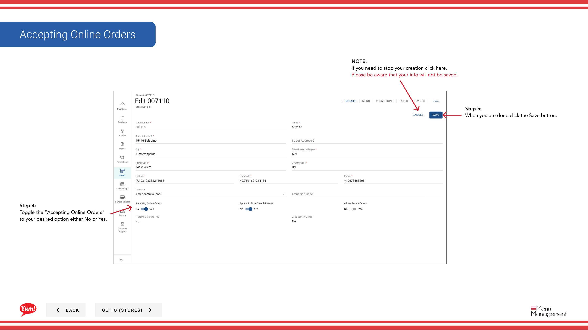

# Aceptar Pedidos en línea (Turn On o Off)

## Qué cubre esta guía

Toggles whether a store accepts online orders through digital channels — used to quickly disable ordering during closures or operational issues.

## Pasos

**Step 1:** Navegue a la sección **Stores** utilizando el menú de navegación de la mano izquierda.

**Step 2:** Buscar en la tienda por **Name**, **Número de página**, o ** Código de Franquicia** utilizando el cuadro de búsqueda.

**Step 3:** Una vez que encuentre la tienda, haga clic en el nombre **store** (o cualquier hipervínculo azul) para ver los detalles de la tienda, o haga clic en el menú ** de tres puntos** (••) icono y seleccione **Editar**.

**Step 4:** Localizar el **Aceptar pedidos en línea** rebosar y ponerlo en su estado deseado:
- *Sí* Store acepta pedidos online a través de canales digitales
- **No**: La tienda no acepta pedidos en línea (los pedidos están temporalmente discapacitados)

**Step 5:** Haga clic en el botón **Guardar** para aplicar el cambio.

:::
Utilice **No** para desactivar rápidamente el pedido durante los cierres de la tienda, mantenimiento del sistema o escasez de personal sin necesidad de editar otros ajustes de la tienda.
:::

:::caution
Hacer clic en **Cancel** en cualquier momento descarta su cambio.
:::

## Guías relacionadas

- [Editar detalles de la tienda](/docs/admin-portal-guide/stores/edit-store-details/)— Actualizar otra información de la tienda

---

*Part of the[Guía del Portal de Admin](/docs/admin-portal-guide)· Sección: Tiendas*