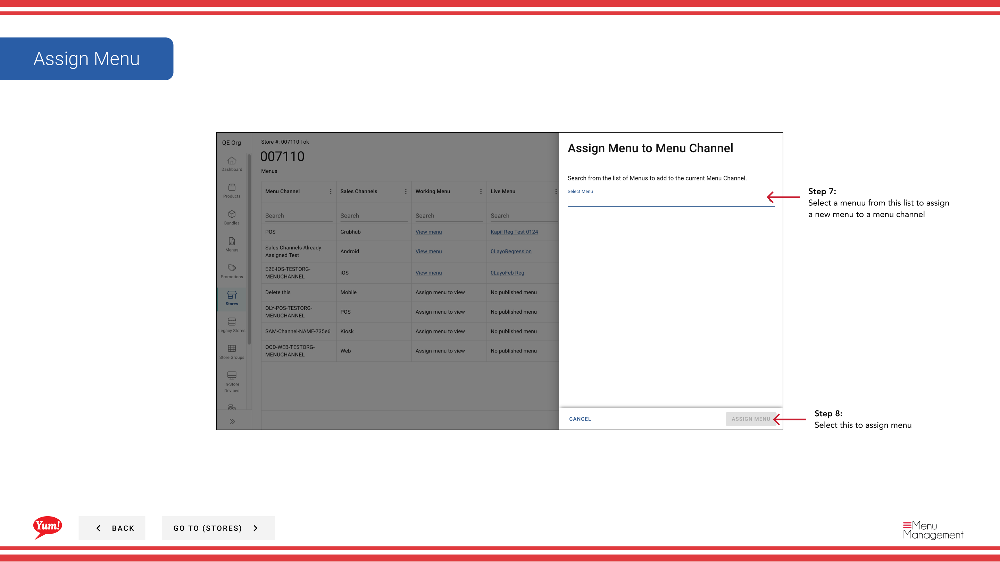

# Nuevo menú

## Qué cubre esta guía

Enlaces un menú publicado al canal de pedidos de una tienda (por ejemplo, Digital, Kiosk, In-Store), determinando lo que los clientes ven al ordenar desde esa ubicación.

## Pasos

**Step 1:** Navegue a la sección **Stores** utilizando el menú de navegación de la mano izquierda.

**Step 2:** Buscar en la tienda por **Name**, **Número de página**, o ** Código de Franquicia** utilizando el cuadro de búsqueda.

**Step 3:** Una vez que encuentre la tienda, haga clic en el menú ** de tres puntos** (••••) icono para abrir el menú de opciones.

**Step 4:** Haga clic en **Menus** del menú desplegable.

**Step 5:** Haga clic en el botón **más menú** (⋯) o **+ Asignar nuevo menú** para revelar opciones adicionales.

**Step 6:** Haga clic en **Asignar nuevo menú**.

**Step 7:** Seleccione un menú publicado de la lista. Este menú será asignado a un canal de pedidos específico para esta tienda.

| Campo | Qué entrar | Notas |
|-------|--------------|-------|
| *Menu* | Seleccione de menús publicados | Sólo los menús publicados aparecen aquí |
| *Channel* | Seleccione el canal de pedido | por ejemplo, Digital, Kiosk, In-Store |

**Step 8:** Haga clic en **Asignación** para confirmar la asignación.

:::
Sólo los menús publicados están disponibles para la asignación. Si el menú que usted necesita no está en la lista, publicarlo primero utilizando[Publicar un menú](/docs/admin-portal-guide/stores/publish-a-menu/).
:::

:::note
Cada tienda puede tener diferentes menús asignados a diferentes canales. Por ejemplo, tu canal digital podría usar un menú mientras tu Kiosco In-Store usa otro.
:::

## Guías relacionadas

- [Ver un menú de la tienda](/docs/admin-portal-guide/stores/view-a-stores-menu/)— Vea qué menús se asignan a una tienda
- [Publicar un menú](/docs/admin-portal-guide/stores/publish-a-menu/)- Hacer un menú en vivo después de la asignación

---

*Part of the[Guía del Portal de Admin](/docs/admin-portal-guide)· Sección: Tiendas*