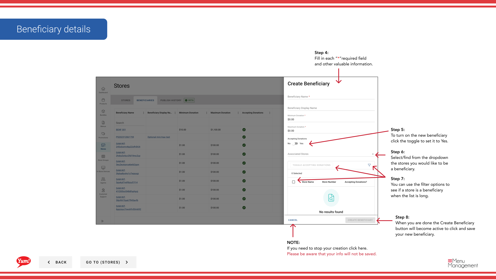

# Crear un Beneficiario

## Qué cubre esta guía

Establece un beneficiario caritativo vinculado a tiendas específicas, permitiendo la recolección de donaciones o la funcionalidad de la campaña de caridad en esos lugares.

## Pasos

**Step 1:** Navegue a la sección **Stores** utilizando el menú de navegación de la mano izquierda.

**Step 2:** Haga clic en la pestaña **Beneficiarios** en la parte superior de la página Tiendas.

**Step 3:** Haga clic en el botón **+ Crear nuevo Beneficiario**.

**Step 4:** Rellene el formulario beneficiario utilizando las descripciones de campo a continuación. Se requieren campos marcados con *.

| Campo | Qué entrar | Notas |
|-------|--------------|-------|
| **Nombre Beneficiario** | Nombre de la caridad o causa | por ejemplo, “KFC Youth Foundation” |
| ** Donaciones aceptadas** | Toggle: Sí o No | Set to Yes to activate donation collection at selected stores |
| # Tortas # | Buscar y seleccionar tiendas para asociarse con este beneficiario | Utilice el cuadro de búsqueda para encontrar tiendas por nombre, número o código |

**Step 5:** Para activar la colección de donaciones para este beneficiario, cambiar **Aceptar donaciones** a **Sí**.

**Step 6:** Utilice el campo **Stores** para buscar y seleccionar las tiendas donde este beneficiario debe estar disponible. Puede utilizar las opciones de filtro para reducir la lista de tiendas por grupo de tiendas u otros criterios.

**Step 7:** Una vez completados todos los campos requeridos, el botón **Crear Beneficiario** se activa. Haga clic en **Crear Beneficiario** para salvar al nuevo beneficiario.

:::
Antes de crear un nuevo beneficiario, utilice el cuadro de búsqueda para confirmar un beneficiario con el mismo nombre ya no existe. Una marca de verificación verde en la columna “Aceptar donaciones” indica que un beneficiario está activo.
:::

:::caution
Clicking **Cancel** en cualquier momento descarta toda la información no salvada.
:::

## Guías relacionadas

- [Ver los Beneficiarios de una tienda](/docs/admin-portal-guide/stores/view-a-stores-beneficiaries/)- Ver todos los beneficiarios vinculados a una tienda
- [Editar/ Eliminar un Beneficiario](/docs/admin-portal-guide/stores/editdelete-a-beneficiary/)— Actualizar o eliminar a un beneficiario

---

*Part of the[Guía del Portal de Admin](/docs/admin-portal-guide)· Sección: Tiendas*