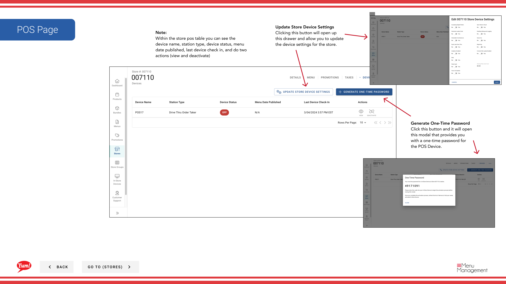

# POS

## Qué cubre esta guía

Muestra los dispositivos de punto de venta conectados de una tienda, su estado, y permite a los operadores actualizar la configuración del dispositivo o generar contraseñas únicas para la autenticación del dispositivo.

:::note Byte POS Caveat
Esta página describe el flujo del Portal de Admin para **La gestión de dispositivos conectados con POS**.

Si el mercado no está utilizando Byte POS, Byte Commerce no habla directamente con ese mercado POS. **Byte Connect** debe estar a bordo como el puente, y el flujo operativo exacto puede diferir de los pasos de nivel del dispositivo que se muestran aquí.
:::

## Pasos

**Step 1:** Navegue a la sección **Stores** utilizando el menú de navegación de la mano izquierda.

**Step 2:** Buscar en la tienda por **Name**, **Número de página**, o ** Código de Franquicia** utilizando el cuadro de búsqueda.

**Step 3:** Una vez que encuentre la tienda, haga clic en el menú ** de tres puntos** (••••) icono para abrir el menú de opciones.

**Step 4:** Haga clic en **POS** del menú desplegable. Esto muestra todos los dispositivos de punto de venta vinculados a la tienda seleccionada.

**Step 5:** Revise la tabla de dispositivos POS, que muestra:

| Columna | Lo que significa |
|--------|--------------|
| ** Nombre del dispositivo** | Nombre de la pantalla del dispositivo POS |
| ** Tipo de estación** | Tipo de estación de POS (por ejemplo, Registro, Cocina, Contador) |
| ** Estado del dispositivo** | Estado actual (Online, Offline, Inactive, etc.) |
| *Menu Publicado* | Fecha el menú fue publicado por última vez en este dispositivo |
| **Última facturación** | Fecha y hora del dispositivo comunicada por última vez con Atlas |

**Step 6:** Utilice los botones de acción para gestionar los dispositivos:
- Haga clic en **Actualizar Configuración del dispositivo de la tienda** para modificar la configuración del dispositivo (nombre, configuración, etc.)
- Haga clic en **Generar contraseña de un tiempo** para crear una contraseña temporal para la autenticación del dispositivo

:::
Utilizar **Última entrada** para verificar que los dispositivos POS se comunican activamente con Atlas. Si un dispositivo no se ha registrado recientemente, puede estar fuera de línea o desconectado.
:::

:::note
Los dispositivos que están fuera de línea o no se registran deben ser investigados para asegurar que las actualizaciones del menú se entregan correctamente.
:::

## Guías relacionadas

- [Editar detalles de la tienda](/docs/admin-portal-guide/stores/edit-store-details/)— Ver otra información de la tienda
- [Byte Connect](/docs/byte-capabilities/enablement/byte-connect)— Entiende cuando los mercados de POS no-Byte requieren Byte Connect

---

*Part of the[Guía del Portal de Admin](/docs/admin-portal-guide)· Sección: Tiendas*
