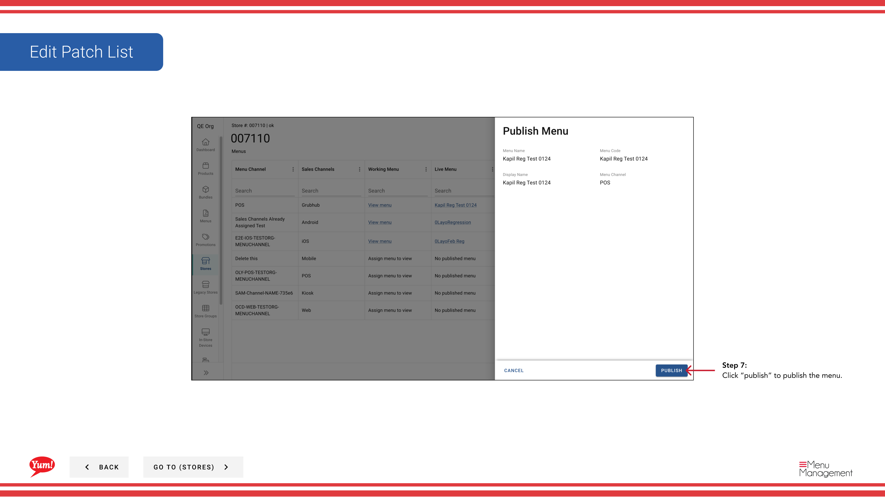

# Publish Menu

## Qué cubre esta guía

Provoca un menú publicando directamente desde la vista Menús de la tienda, empujando la configuración actual del menú en directo a los canales de pedidos.

## Pasos

**Step 1:** Navegue a la sección **Stores** utilizando el menú de navegación de la mano izquierda.

**Step 2:** Buscar en la tienda por **Name**, **Número de página**, o ** Código de Franquicia** utilizando el cuadro de búsqueda.

**Step 3:** Una vez que encuentre la tienda, haga clic en el menú ** de tres puntos** (••••) icono para abrir el menú de opciones.

**Step 4:** Haga clic en **Menus** del menú desplegable. Esto muestra los menús asignados a esta tienda por canal.

**Step 5:** Localice el canal que desea publicar, y haga clic en el botón **más** (⋯) en esa fila.

**Step 6:** Haga clic en **Publish Menu** del menú de opciones.

**Step 7:** Revise la configuración del menú y cualquier cambio pendiente.

**Step 8:** Haga clic en el botón **Publicar** para presionar el menú en directo a los clientes.

:::
**When to use:** Utilice este método cuando publique desde la vista del menú de una tienda. Uso[Publicar un menú](/docs/admin-portal-guide/stores/publish-a-menu/)si necesita publicar menús a través de múltiples tiendas o canales a la vez.
:::

:::caution
Publicar un menú de inmediato hace que los cambios sean visibles para los clientes. Revise todos los cambios antes de hacer clic en Publish.
:::

## Guías relacionadas

- [Ver un menú de la tienda](/docs/admin-portal-guide/stores/view-a-stores-menu/)— Ver menús asignados
- [Publicar un menú](/docs/admin-portal-guide/stores/publish-a-menu/)— Publish multiple stores at once
- [Editar lista de parches](/docs/admin-portal-guide/stores/edit-patch-list/)— Modificar el menú anula antes de publicar

---

*Part of the[Guía del Portal de Admin](/docs/admin-portal-guide)· Sección: Tiendas*