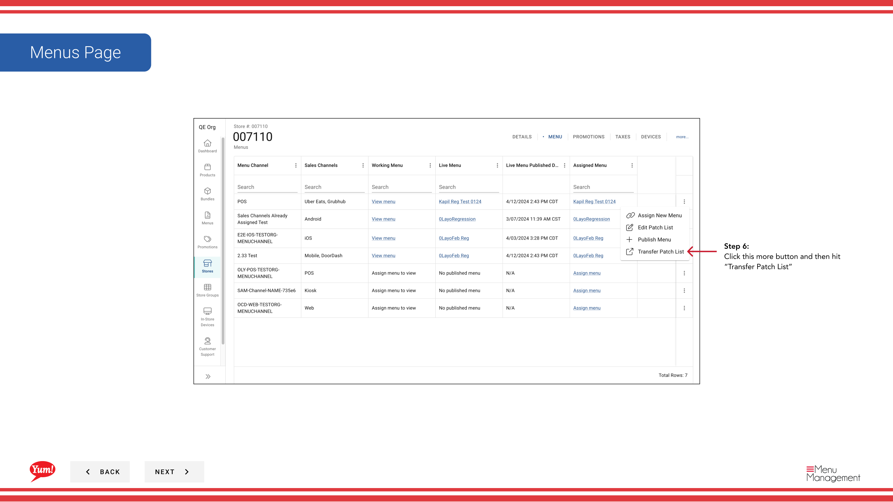

# Lista del parche de transferencia

## Qué cubre esta guía

Copia la configuración de la lista de parches de una tienda a una o más tiendas, racionalizando la gestión de parches en múltiples ubicaciones con las mismas anulaciones.

## Pasos

**Step 1:** Navegue a la sección **Stores** utilizando el menú de navegación de la mano izquierda.

**Step 2:** Busque la tienda ** de fuente** (la tienda cuyos parches desea copiar) por **Nombre**, **Número de piso**, o ** Código de Franquicia**.

**Step 3:** Una vez que encuentre la tienda, haga clic en el menú ** de tres puntos** (••••) icono para abrir el menú de opciones.

**Step 4:** Haga clic en **Menus** del menú desplegable.

**Step 5:** Localice el canal con parches que desea transferir, y haga clic en el botón **más** (⋯) en esa fila.

**Step 6:** Haga clic en ** Lista de parches de transferencia** del menú de opciones.

**Step 7:** Seleccione los **patches** que desea transferir revisando sus nombres. Revise la lista de parches a copiar.

**Step 8:** Seleccione las tiendas **destino** donde desea copiar estos parches. Puedes:
- Buscar tiendas por nombre, número o código
- Filtrar por **Store Group** utilizando el desplegable para seleccionar rápidamente todas las tiendas en un grupo

**Step 9:** Seleccione el canal **menu** donde se deben aplicar los parches en las tiendas de destino (por ejemplo, Digital, Kiosk, In-Store).

**Step 10:** Revise los detalles de transferencia para verificar todo es correcto antes de proceder.

**Step 11:** Haga clic en **Guardar** (o **Transferir**) para copiar los parches a las tiendas de destino seleccionadas.

:::
**Store Groups shortcut:** Utilice el filtro desplegable **Store Group** para seleccionar rápidamente todas las tiendas en una región o grupo de franquicias, en lugar de buscar cada tienda individualmente.
:::

:::note
Transfiere copias de los parches como se les ordena. Después de la transferencia, verifique que los parches funcionan correctamente en las tiendas de destino antes de publicar a los clientes.
:::

## Guías relacionadas

- [Editar lista de parches](/docs/admin-portal-guide/stores/edit-patch-list/)— Administrar parches en una sola tienda
- [Publish Menu](/docs/admin-portal-guide/stores/publish-menu/)— Publicar el menú después de transferir parches

---

*Part of the[Guía del Portal de Admin](/docs/admin-portal-guide)· Sección: Tiendas*