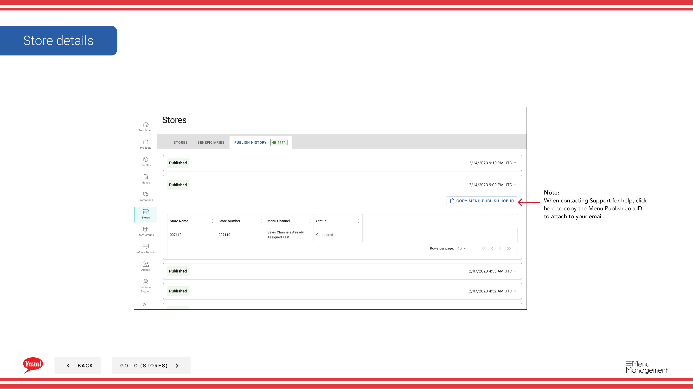

# Ver una tienda Publicar historia / Copiar menú Publicar el ID de trabajo

## Qué cubre esta guía

Muestra un registro de todos los menús publica trabajos para una tienda, incluyendo estado y horarios. Puedes ver los detalles de cada trabajo publicado y copiar el menú Publicar el ID de trabajo con fines de soporte.

## Pasos

**Step 1:** Navegue a la sección **Stores** utilizando el menú de navegación de la mano izquierda.

**Step 2:** Haga clic en la pestaña **Publish History** en la parte superior de la página Tiendas.

**Step 3:** La tabla de historia publica muestra:
- *Menu* Nombre del menú publicado
- ** Canal** — Canal de pedidos (Digital, Kiosk, In-Store, etc.)
- **Estatus** — Estado de publicación (Consejo, Pensión, Failed, etc.)
- **Tiempo** — Fecha y hora del trabajo publicado

Haga clic en cualquier fila para abrir los detalles completos, incluyendo el **Menu Publish Job ID**.

**Step 4:** Para copiar el **Menu Publish Job ID** (usuario para contactar con soporte), haga clic en el icono **copia** junto al campo de identificación de empleo en el panel de detalles.

:::
**When to use Menu Publish Job ID:** Al ponerse en contacto con Atlas Support sobre un problema de publicación, incluya el menú Publicar el ID de trabajo para ayudar al equipo de soporte a localizar rápidamente el trabajo específico y diagnosticar el problema.
:::

## Guías relacionadas

- [Publicar un menú](/docs/admin-portal-guide/stores/publish-a-menu/)— Publicar menús a canales
- [Ver un menú de la tienda](/docs/admin-portal-guide/stores/view-a-stores-menu/)— Ver menús asignados actualmente

---

*Part of the[Guía del Portal de Admin](/docs/admin-portal-guide)· Sección: Tiendas*