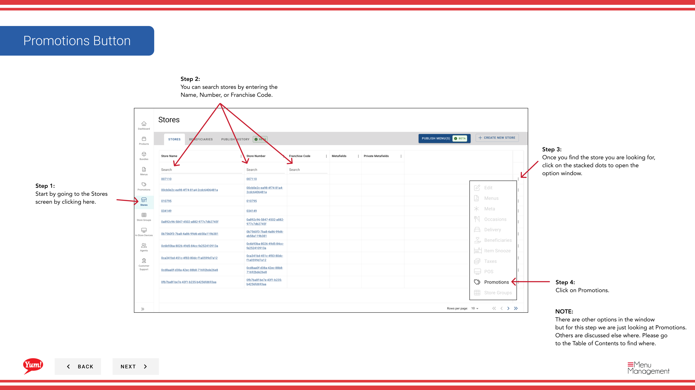

# View Promotions

## Qué cubre esta guía

Muestra todas las promociones asignadas actualmente a una tienda, permitiéndole buscar y filtrar por nombre de promoción o código de redención.

## Pasos

**Step 1:** Navegue a la sección **Stores** utilizando el menú de navegación de la mano izquierda.

**Step 2:** Buscar en la tienda por **Name**, **Número de página**, o ** Código de Franquicia** utilizando el cuadro de búsqueda.

**Step 3:** Una vez que encuentre la tienda, haga clic en el menú ** de tres puntos** (••••) icono para abrir el menú de opciones.

**Step 4:** Haga clic en **Promociones** del menú desplegable. Esto muestra todas las promociones vinculadas a la tienda seleccionada.

**Step 5:** Utilice las opciones de búsqueda y filtro para encontrar promociones específicas:
- Buscar por **Nombre de promoción** para encontrar promociones por nombre de pantalla
- Buscar por ** Código de exención** para encontrar promociones por su redención o código de promo

La tabla de promociones muestra:
- **Nombre de promoción** - Nombre de la promoción
- ** Código de exención** - Los clientes del Código entran para redimir la promoción
- **Estatus** — Activo, Inactivo u otro estado
- **Valide De / A** — Fechas de inicio y finalización de promoción

:::
Utilice filtros para estrechar la lista de promoción si su tienda tiene muchas promociones activas. Esto le ayuda a verificar rápidamente qué promociones se están ejecutando actualmente.
:::

## Guías relacionadas

- [Editar detalles de la tienda](/docs/admin-portal-guide/stores/edit-store-details/)— Ver otra información de la tienda

---

*Part of the[Guía del Portal de Admin](/docs/admin-portal-guide)· Sección: Tiendas*