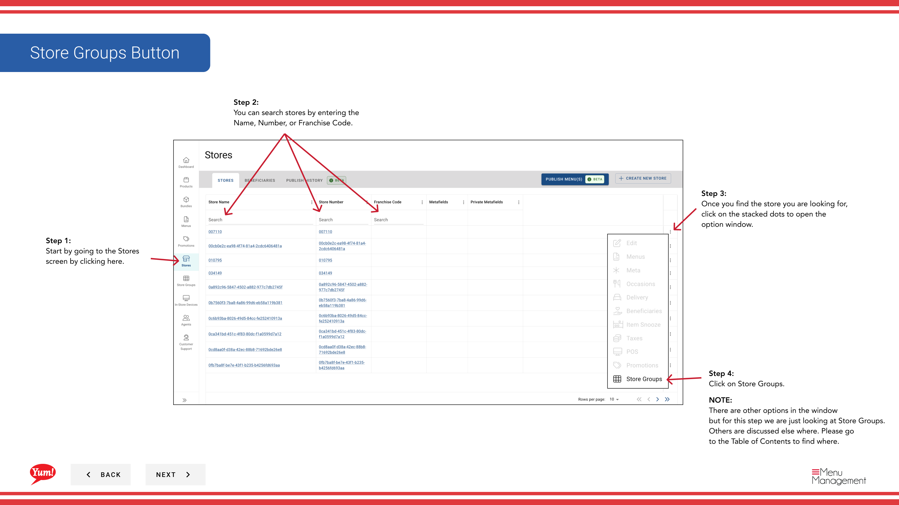

# View/Unassign a Store Groups

## Qué cubre esta guía

Muestra a los grupos de tiendas a los que pertenece una tienda y permite a los operadores desactivar la tienda de un grupo cuando sea necesario.

## Pasos

**Step 1:** Navegue a la sección **Stores** utilizando el menú de navegación de la mano izquierda.

**Step 2:** Buscar en la tienda por **Name**, **Número de página**, o ** Código de Franquicia** utilizando el cuadro de búsqueda.

**Step 3:** Una vez que encuentre la tienda, haga clic en el menú ** de tres puntos** (••••) icono para abrir el menú de opciones.

**Step 4:** Haga clic en **Store Groups** del menú desplegable. Esto muestra a todos los grupos de tiendas a los que se asigna la tienda seleccionada.

**Step 5:** Revise la tabla de grupos de tiendas, que muestra:
- **Store Group Name** — Nombre del grupo de tiendas que pertenece a esta tienda
- **Estatus** - Estado de asignación (Activa, etc.)

**Step 6:** Utilice el cuadro de búsqueda/filtro para estrechar la lista por **store nombre del grupo** si la lista es larga.

### A Unassignar una tienda de un grupo:

**Step 7:** Haga clic en el menú ** de tres puntos** (•••) icono en la fila del grupo de la tienda que desea eliminar.

**Step 8:** Haga clic en **Unassign** del menú. Esto elimina la tienda del grupo de la tienda seleccionada.

**Step 9:** Confirme la insignia en el modal que aparece haciendo clic en **Unassign** de nuevo.

:::caution
Una firma de una tienda de un grupo puede afectar las reglas fiscales, promociones y configuraciones de menú ligadas a ese grupo. Verifique con su gerente regional antes de no firmar.
:::

:::
Los grupos de tiendas se utilizan para organizar tiendas por región, franquicia o categoría operacional. Compruebe qué grupos de tiendas deben estar asociados con una tienda antes de hacer cambios.
:::

## Guías relacionadas

- [Ver impuestos](/docs/admin-portal-guide/stores/view-taxes/)— Ver reglas fiscales por grupo de tiendas

---

*Part of the[Guía del Portal de Admin](/docs/admin-portal-guide)· Sección: Tiendas*