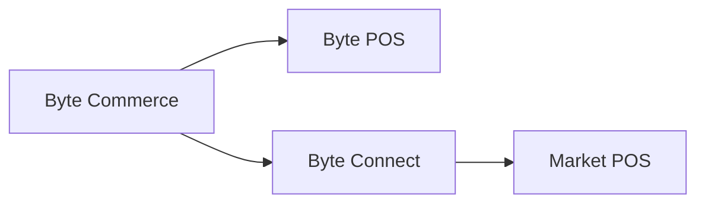

# Byte Connect

En el contexto Atlas, Byte Connect es la capa de integración dentro de la plataforma Byte que se vuelve importante cuando Byte Commerce necesita alcanzar un entorno POS no-Byte o un canal de ventas externo.

---

## Atlas Context

Dentro de Atlas Wiki, Byte Connect debe entenderse como parte del cuadro operativo más amplio **Atlas + Byte Commerce + Byte Portal**.

- **Atlas** es el frente global de KFC
- **Byte Commerce** maneja lógica de transacción y orquestación de orden
- **Byte Portal** es la superficie principal de administración para la configuración de mercado y operaciones
- **Byte Connect** es la capa de integración utilizada cuando está involucrado el enrutamiento de canales externos o la conectividad POS no-Byte

Esto significa que Byte Connect no es el producto orientado al cliente y no la interfaz de usuario diaria, pero sigue siendo parte de la pila Byte cuando los mercados dependen de las integraciones de canales de terceros o de una configuración de POS no-Byte.

---

## La regla básica

Si un mercado es **no** usando **Byte POS**, entonces **Byte Connect debe estar a bordo como parte de Byte Commerce a bordo**.

Byte Commerce está conectado para hablar directamente con **Byte POS**. Para los mercados POS no-Byte, Byte Connect se encuentra en el centro y maneja el camino de integración al mercado POS.

---

## Lo que Byte Connect hace

Byte Connect actúa como una solución de integración dentro de la plataforma Byte, administrada principalmente a través de **Business API**, que ayuda a las tiendas y marcas a conectar Byte Commerce a:

- entornos de POS no biológicos
- Mercados de entrega de terceros
- otros canales de ventas externos

En términos Atlas, esto significa que Byte Connect es la capa que ayuda a la plataforma a llegar más allá de la ruta estándar **Byte Commerce - confiar Byte POS**.

Eso significa que el modelo mental operativo es:

- **Byte Commerce - Propiedad Byte POS** cuando el mercado utiliza Byte POS
- **Byte Commerce - Propiedad Byte Connect - Propiedad POS** cuando el mercado no utiliza Byte POS

Lo más importante para evitar es asumir que Byte Commerce puede hablar directamente con cualquier POS de mercado o canal externo por defecto. No puede. Si Byte POS no está presente, o si el mercado depende de las integraciones de canales de terceros soportadas, Byte Connect se convierte en parte del camino.

---

## Capacidades clave

Byte Connect puede soportar:

- ** Canales de venta de terceros** como Uber Eats, DoorDash, Grubhub, Just Eat, and Deliveroo
- **Controles de precios de nivel de canales**, incluida la configuración de marcación de mercado
- **Delivery routing choice** for each channel, such as marketplace-fulfilled delivery vs. internally fulfilled delivery
- **Reglas de instrucciones para conductores** para apoyar el manejo adecuado del orden aguas abajo
- **Configuración del canal de nivel remoto** gestionado a través de operaciones de API de negocio, como`updateByteConnectStoreChannelConfig`

Esta es la forma más útil de contextualizar Byte Connect en Atlas: no es sólo un conector genérico. Es una capa de integración respaldada por la configuración que rige cómo las tiendas de un mercado interactúan con canales de entrega externos y, cuando sea pertinente, cómo Byte Commerce alcanza la infraestructura POS no-Byte.

---

## Lo que significa para el a bordo

Para los mercados de POS no-Byte, Byte Connect no es un complemento opcional. Es parte del paquete Byte Commerce a bordo.

Los equipos de planificación del mercado, el alcance de la puesta en marcha, los plazos, las responsabilidades de integración o el agregador a bordo deben tratar a Byte Connect como una dependencia estándar siempre que:

- el mercado POS no es Byte POS
- el mercado depende de canales de entrega de terceros compatibles
- reglas de canal externo a nivel de tienda deben ser configuradas o gobernadas centralmente

En términos prácticos de Atlas, esto significa que la planificación de lanzamiento debe tratar a Byte Connect como parte de la preparación para la integración, no como una idea posterior después de la configuración de entrada y portal ya están completos.

---

## Caveat operacional

Muchas capacidades de Byte Connect se describen actualmente como **BETA**, y algunas operaciones pueden no estar disponibles en cada entorno de producción. El acceso a estas operaciones normalmente requiere`byte_connect`papel en la API de negocios.

Eso importa para Atlas porque los equipos no deben asumir que cada mercado tendrá la misma superficie de Byte Connect habilitada al mismo tiempo.

---

## Cuándo Referenciar esto

Utilice esta página cuando los equipos necesiten explicar:

- por qué Byte Commerce no se integra directamente con cada POS
- por qué un mercado POS no-Byte necesita Byte Connect
- por qué el agregador y la configuración del canal externo pueden sentarse fuera de la vista de funcionamiento Portal-primera
- cómo Byte Commerce alcanza el sistema de tiendas en un mercado POS no-Byte
- cómo los canales de entrega compatibles de terceros se configuran en la capa de integración en lugar de sólo en el extremo frontal

---

:::tip Relacionados
- [Límites de responsabilidad](/docs/byte-capabilities/enablement/capability-boundaries)
- [Referencia de Backend de Comercio](/docs/byte-capabilities/reference/commerce-backend)
- [Plataforma modelo mental](/docs/byte-capabilities/mental-model)
:::
