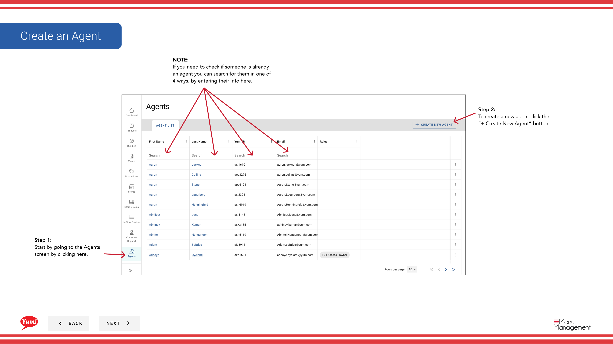
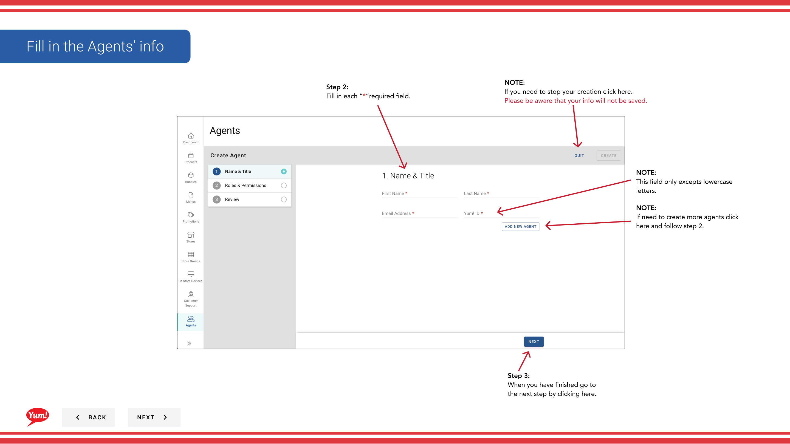

# Créer un Agent

## Ce que ce guide couvre

Mettre en place un nouveau compte utilisateur avec des rôles et des permissions spécifiques, accorder aux opérateurs du marché ou soutenir l'accès du personnel pour gérer le portail Byte Commerce Admin.

## Étapes

**Step 1:** Naviguez dans la section **Agents** en utilisant le menu de navigation de gauche.

**Step 2:** Cliquez sur le bouton **+ Créer un nouvel agent**.

**Step 3:** Remplissez les détails de l'agent sur la page 1. Les champs marqués d'un * sont obligatoires.

| Champ | Quoi entrer | Annexe |
|-------|--------------|-------|
| **Prénom** * | Prénom de l'agent | Par exemple, John |
| **Nom de famille** * | Nom de famille de l'agent | Par exemple, "Smith" |
| **Adresse électronique** * | Courriel valide pour la connexion et les notifications | Doit être unique — aucun deux agents ne peut avoir le même courriel. Utilisé pour réinitialiser les mots de passe et les messages système. |
| **Nom d'utilisateur** * | Identifiant de connexion | Doit être en minuscules seulement — pas d'espaces, de chiffres ou de caractères spéciaux (par exemple,`jsmith`, `john.smith`** Ne peut être changé après la création.** |

:::caution
Avant de créer un nouvel agent, recherchez par Prénom, Nom, Adresse e-mail ou Nom d'utilisateur pour vérifier qu'ils n'ont pas déjà un compte.
:::

**Step 4:** Cliquez sur **Suivant** pour passer à la page 2 — Rôles et autorisations.

**Step 5:** Examiner les rôles disponibles et vérifier tout ce qui s'applique à cet agent. Rôles contrôlent les sections de Byte Portal que l'agent peut accéder et les actions qu'il peut effectuer.

| Rôle | Ce qu'il fait |
|------|-------------|
| **Gestionnaire principal** | Peut créer, modifier et publier des menus |
| ** Gestionnaire de matériel** | Peut gérer les paramètres et configurations des magasins |
| **Gestionnaire des promotions** | Peut créer et gérer des promotions |
| **Agent de soutien à la clientèle** | Peut rechercher des commandes et des clients, émettre des remboursements |
| ** Administrateur du système** | Accès complet à toutes les sections du portail Byte |

:::note :
Les rôles disponibles peuvent varier selon votre organisation. Cochez les cases pour chaque rôle dont cet agent a besoin.
:::

**Step 6:** Cliquez sur **Suivant** pour passer à la page 3 — Revue.

**Step 7:** Examinez tous les détails saisis pour en vérifier l'exactitude. Cliquez sur n'importe quel en-tête de section bleue pour revenir en arrière et faire des corrections.

**Step 8:** Cliquez sur **Créer** pour finaliser le compte agent.

:::tip
Après avoir créé un agent, vous pouvez cliquer **Ajouter un autre agent** pour créer des agents supplémentaires sans retourner à la liste des agents.
:::

:::caution
Cliquez sur **Annuler** à tout moment rejette toutes les informations non enregistrées.
:::

## Guides connexes

- [Modifier un agent](/docs/admin-portal-guide/agents/edit-an-agent/)

---

* Une partie des[Guide du portail administratif](/docs/admin-portal-guide)· Section: Agents*