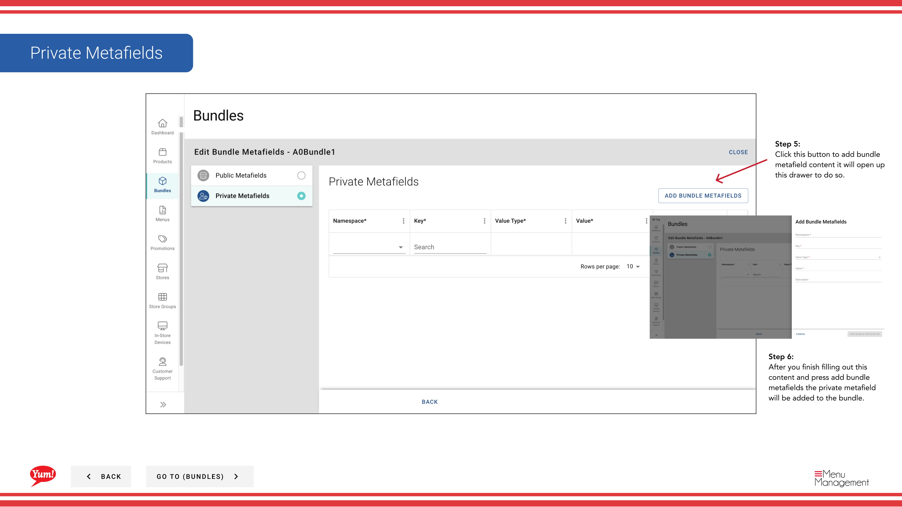

# Ajouter des Metafields à un ensemble

## Ce que ce guide couvre

Joindre des données personnalisées de valeur de clé à un paquet pour les intégrations, la conformité, ou le suivi interne — ajouter des métachamps seulement si votre équipe technique a spécifié des clés et des valeurs exactes.

## Étapes

**Step 1:** Naviguez dans la section **Bundles** en utilisant le menu de navigation à gauche.

**Step 2:** Trouvez le bundle auquel vous voulez ajouter des métachamps en cherchant par nom de bundle, code de bundle, étiquettes de catalogue ou étiquettes promo.

**Step 3:** Cliquez sur le bouton **.** (menu à trois points) dans la même ligne que le paquet, puis sélectionnez **Meta**.

**Step 4:** Un tiroir s'ouvre avec deux sections : **Metafields publics** et **Metafields privés**. Vous pouvez ajouter l'un ou l'autre ou les deux.

**Pour les Métafields publics (visibles aux intégrations):**

**Step 5:** Cliquez sur **Ajouter Metafield** dans la section Metafields publics.

**Step 6:** Remplissez les paires de valeurs clés :
- **Key**: Nom du champ de métadonnées (p. ex.`external_id`, `supplier_code`)
- **Valeur**: La valeur correspondante (par exemple,`12345`)

Cliquez sur **Ajouter Metafield** pour confirmer.

**Pour les Métafields privés (usage interne seulement):**

**Step 7:** Cliquez sur **Ajouter Metafield** dans la section Metafields privés.

**Step 8:** Remplissez les paires de valeurs clés en utilisant le même format que ci-dessus.

Cliquez sur **Ajouter Metafield** pour confirmer.

**Step 9:** Une fois tous les métachamps ajoutés, cliquez sur **Enregistrer** pour lancer les modifications.

:::caution
Ajouter des métachamps seulement si votre équipe technique a spécifié les clés et les valeurs exactes nécessaires pour les intégrations ou la conformité. Les métachamps incorrects peuvent briser les intégrations.
:::

:::tip
Vous pouvez ajouter plusieurs métafields publics et privés. Vous n'êtes pas tenu d'ajouter les deux — choisissez seulement ce dont votre système a besoin.
:::

## Guides connexes

- [Créer un ensemble](/docs/admin-portal-guide/bundles/create-a-bundle/)
- [Modifier un bundle](/docs/admin-portal-guide/bundles/edit-a-bundle/)

---

* Une partie des[Guide du portail administratif](/docs/admin-portal-guide)· Section: Ensembles*