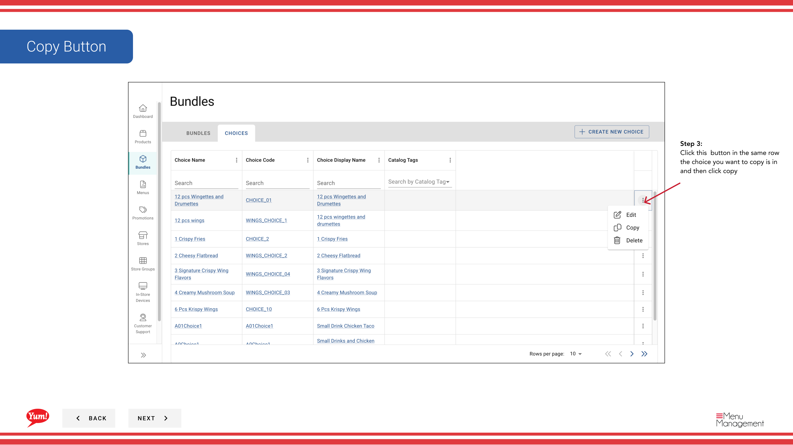

# Copier un choix

## Ce que ce guide couvre

Dupliquer un choix existant pour créer rapidement des emplacements de sélection similaires pour d'autres paquets.

## Étapes

**Step 1:** Naviguez dans la section **Bundles** en utilisant le menu de navigation à gauche.

**Step 2:** Cliquez sur l'onglet **Choices** en haut de l'écran Bundles.

**Step 3:** Trouvez le choix que vous voulez copier en recherchant par Nom de choix, Code de choix, Nom d'affichage de choix, ou Tags de catalogue.

**Step 4:** Cliquez sur le bouton *** (menu à trois points) dans la même ligne que le choix, puis sélectionnez **Copier**.

**Step 5:** Un formulaire s'ouvre pour créer le nouveau choix. Vous devez entrer un code de choix unique**.

**Step 6:** Ajuster le nom **Choisir** si nécessaire. Par défaut, ce sera le Copie de [Nom d'origine] - mettre à jour quelque chose descriptif.

**Step 7:** Consultez tous les autres champs (quantité minimum/max., produits, variantes, etc.). Tous les paramètres du choix original sont hérités. Modifier au besoin.

**Step 8:** Cliquez sur **Créer un choix** pour terminer la création du choix dupliqué.

:::tip
Le choix copié comprend tous les produits et variantes de l'original. Vous pouvez les modifier avant ou après la création.
:::

## Guides connexes

- [Créer un choix](/docs/admin-portal-guide/bundles/create-a-choice/)
- [Modifier un choix](/docs/admin-portal-guide/bundles/edit-a-choice/)
- [Supprimer un choix](/docs/admin-portal-guide/bundles/delete-a-choice/)

---

* Une partie des[Guide du portail administratif](/docs/admin-portal-guide)· Section: Ensembles*