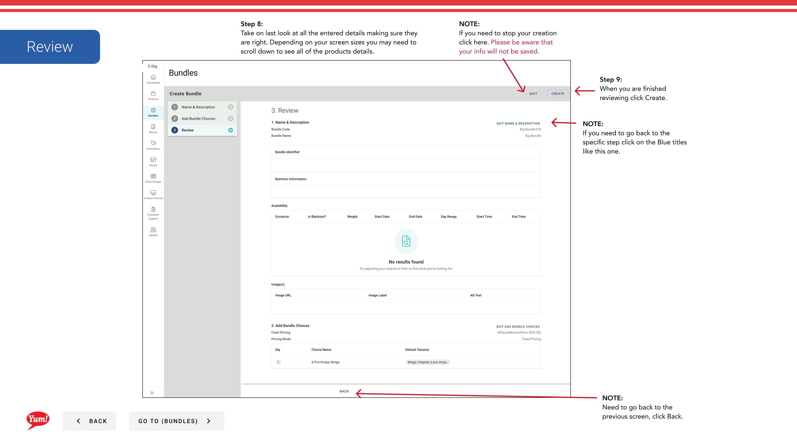

# Créer un ensemble

## Ce que ce guide couvre

Constitue une offre de combo ou de repas en regroupant les produits sous un seul objet purchasable, avec son propre code, prix et affichage des informations.

## Étapes

**Step 1:** Naviguez dans la section **Bundles** en utilisant le menu de navigation à gauche.

**Step 2:** Cliquez sur le bouton **+ Créer un nouveau bloc**.

**Step 3:** Remplissez les détails du paquet sur la page 1. Les champs marqués d'un * sont obligatoires.

| Champ | Quoi entrer | Annexe |
|-------|--------------|-------|
| **Code du pavillon** * | identificateur unique du système | Utilisez des lettres majuscules, des chiffres et des tirets, par exemple:`BUNDLE-3PC-MEAL` |
| Nom du pavillon | Afficher le nom affiché aux clients | p.ex., repas de 3 pièces |
| **Afficher le nom** | Étiquette plus courte pour les écrans à espace limité | Par défaut vers le nom du groupe si laissé vide |
| **Description** | Description du paquet par le client | Gardez-le attrayant et clair |

:::tip
Cliquez sur le bouton **Ajouter des détails** pour ajouter des informations optionnelles comme l'information nutritionnelle, un identifiant de groupe, des étiquettes de catalogue et des étiquettes promo.
:::

:::tip
Cliquez sur le tiroir **Disponibilité de l'article** pour définir les fenêtres de disponibilité (p. ex., 11h–3h) lorsque ce paquet doit être commandé.
:::

**Step 4:** Cliquez sur **Suivant** ou sélectionnez la prochaine étape en haut pour passer à la page 2 — Choix.

**Step 5:** Ajoutez des choix à votre paquet. Un choix est un emplacement de sélection (p. ex., Choisir votre côté).

- Pour ajouter un choix ** existant** : Cliquez sur **Ajouter le choix existant**. Un tiroir de recherche s'ouvre — tapez pour rechercher et cliquez sur le choix pour le sélectionner, puis cliquez sur **Ajouter**.
- Pour créer un **nouveau choix en ligne**: Cliquez sur **Créer un nouveau choix** et remplissez les champs:

| Champ | Quoi entrer | Annexe |
|-------|--------------|-------|
| **Code de choix** * | identificateur unique | Par exemple,`CHOICE-SIDE` |
| **Nom de choix** * | Étiquette montrée aux clients | Par exemple, choisir votre côté, choisir votre boisson |
| ** Quantité minimale** | Sélection minimale requise | Réglé sur`0`de rendre le choix facultatif |
| ** Quantité maximale** | Sélection maximale autorisée | Par exemple,`1`pour un choix unique |
| **Produits** | Articles disponibles dans ce choix | Rechercher et ajouter à partir de la liste de produits |

**Step 6:** Cliquez sur **Suivant** pour passer à la page 3 — Revue.

**Step 7:** Revoir tous les détails saisis. Cliquez sur n'importe quel en-tête de section bleue pour revenir en arrière et faire des corrections. Cliquez sur **Créer** pour finaliser le paquet.

:::caution
Cliquez sur **Annuler** à tout moment rejette toutes les informations non enregistrées.
:::

## Guides connexes

- [Ajouter une image à un bundle](/docs/admin-portal-guide/bundles/add-an-image-to-a-bundle/)
- [Modifier un bundle](/docs/admin-portal-guide/bundles/edit-a-bundle/)
- [Copier un ensemble](/docs/admin-portal-guide/bundles/copy-a-bundle/)

---

* Une partie des[Guide du portail administratif](/docs/admin-portal-guide)· Section: Ensembles*