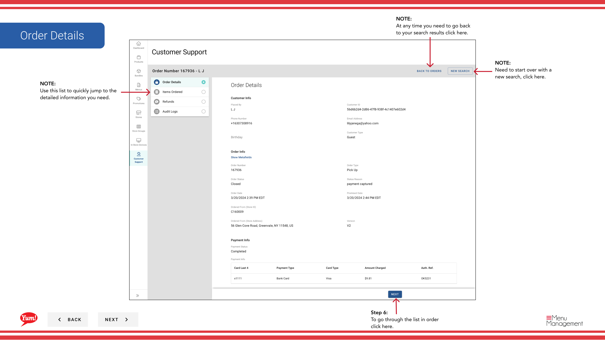
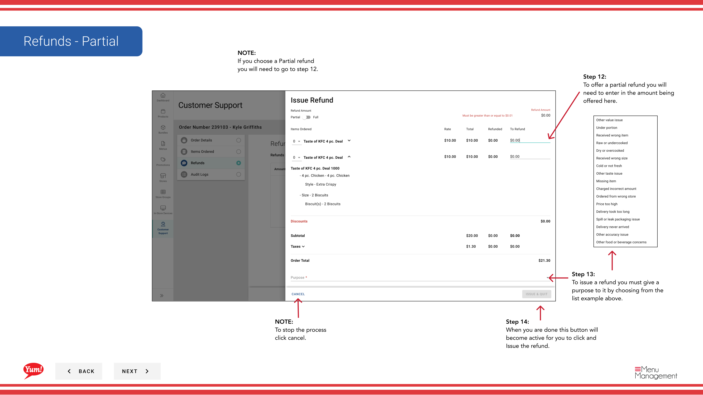
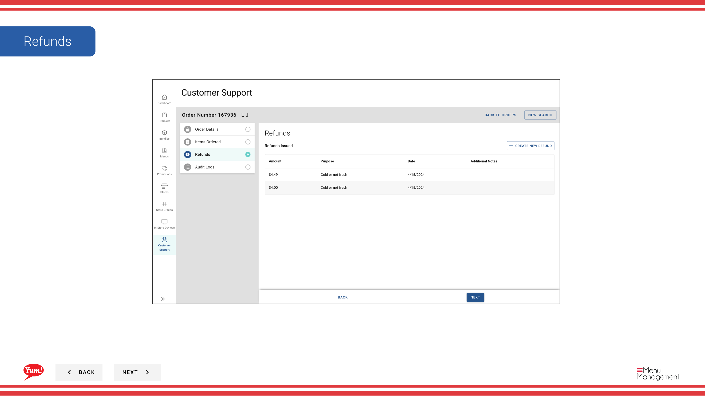

# Commander la recherche

## Ce que ce guide couvre

Trouver une commande spécifique du client à l'aide de filtres tels que l'identifiant de commande, la date ou le nom du client — l'outil principal pour les agents de soutien enquêtant sur les problèmes de commande, en émettant des remboursements ou en renvoyant des reçus.

## Étapes

**Step 1:** Naviguez dans la section Assistance au client** en utilisant le menu de navigation à gauche.

**Step 2:** Remplissez autant de champs de recherche que possible pour réduire vos résultats :

| Chapitre | Champs | Annexe |
|---------|--------|-------|
| **Renseignements sur la commande** | Numéro de commande, date de commande, magasin, état de la commande | Order ID est le plus précis — utilisez-le si disponible. |
| **Adresse de livraison** | Rue, ville, code postal | Utiliser pour filtrer par lieu de livraison. |
| **Renseignements sur la clientèle** | Nom du client, adresse électronique, numéro de téléphone | Remplissez le prénom, le nom de famille ou les deux. |

Plus vous remplissez de champs, plus vos résultats sont précis.

**Step 3:** Cliquez sur **Rechercher** pour révéler vos résultats.

**Step 4:** Les résultats de votre recherche apparaissent dans un tableau avec des colonnes d'informations d'ordre. Vous devrez peut-être faire défiler à gauche ou à droite pour voir toutes les colonnes. Utilisez le menu *** (trois points) dans l'en-tête des résultats pour afficher ou masquer des colonnes spécifiques.

**Step 5:** Cliquez sur le **Numéro de commande** pour ouvrir la vue complète de la commande avec toutes les informations de transaction.

## Reçus

**Step 6:** Dans la vue des détails de la commande, cliquez sur l'icône **reçu** ou naviguez vers l'option de réception dans le menu.

**Step 7:** Un tiroir s'ouvre. Vérifiez l'adresse courriel du client ou entrez un autre courriel si nécessaire.

**Step 8:** Cliquez sur **Envoyer** pour envoyer le reçu par courriel au client.

:::tip
Vous pouvez envoyer des reçus à une autre adresse électronique si le courriel enregistré du client est incorrect ou périmé.
:::

## Remboursements

**Step 9:** Dans la vue des détails de la commande, cliquez sur l'icône **remboursement** ou accédez à l'option de remboursement.

**Step 10:** Sélectionnez le type de remboursement:

| Option | Que faire |
|--------|-----------|
| ** Remboursement intégral** | Remboursement de la totalité du montant de la commande |
| ** Remboursement partiel** | Remboursement seulement une partie de la commande — vous indiquerez le montant à rembourser |

**Step 11:** Sélectionnez un **Rembourser la raison** dans la liste déroulante (obligatoire) :

| Motifs | Quand utiliser |
|--------|------------|
| Erreur de commande | La commande a été mal passée. |
| Éléments manquants | Les articles livrés manquaient de commande. |
| Plainte du client | Le client n'est pas satisfait pour d'autres raisons |
| Autres | Pour les questions non couvertes ci-dessus |

**Step 12:** Si vous effectuez un remboursement partiel**, inscrivez le montant du remboursement dans le champ **Remboursement**.

**Step 13:** Cliquez sur **Remboursement de l'émission** lorsque le bouton devient actif (tous les champs obligatoires sont remplis).

:::caution
Les remboursements sont permanents. Une fois émis, le mode de paiement du client sera crédité. Vérifiez la raison et le montant avant de cliquer sur **Remboursement de la question**.
:::

## Conseils de navigation

:::note :
Sur les écrans plus petits, les sections « Adresse de livraison » et « Renseignements sur les clients » peuvent ne pas être visibles par défaut. Faites défiler vers le bas ou cliquez sur les en-têtes de section pour les agrandir.
:::

:::note :
Si vous devez ajuster votre recherche, cliquez sur **Reset Form** pour effacer tous les champs et recommencer.
:::

:::note :
Pour modifier l'affichage des résultats, cliquez sur le **.** (menu à trois points) dans l'en-tête des résultats pour afficher/cacher les colonnes ou ajuster les résultats par page (jusqu'à 50).
:::

## Guides connexes

- [Recherche client](/docs/admin-portal-guide/customer-support/customer-search/)

---

* Une partie des[Guide du portail administratif](/docs/admin-portal-guide)· Section : Service à la clientèle*