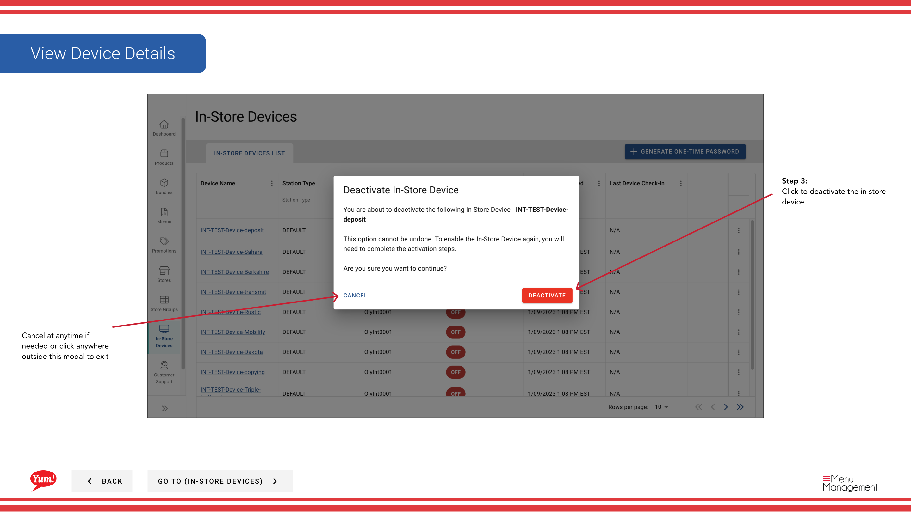

# Désactivation en cours de fabrication

## Ce que ce guide couvre

Désactive un terminal ou un kiosque POS à partir de la réception des mises à jour du menu et du traitement des commandes. Cette action est réversible — le dispositif peut être réactivé à tout moment.

:::note Octet POS Cavat
Ce guide suppose que l'appareil est géré dans le cadre d'un déploiement **Byte POS** dans le portail Admin.

Si le marché n'utilise pas Byte POS, **Byte Connect** doit faire partie de Byte Commerce à bord, et les contrôles opérationnels pour le marché POS peuvent différer du flux de désactivation de l'appareil indiqué ici.
:::

## Étapes

**Step 1:** Naviguez dans la section des appareils **In-Store** en utilisant le menu de navigation de gauche.

**Step 2:** Trouvez l'appareil que vous voulez désactiver. Vous pouvez rechercher ou filtrer par type de station, numéro de magasin ou état de l'appareil.

**Step 3:** Cliquer sur le bouton **=** (menu à trois points) dans la même ligne que l'appareil, puis sélectionner ** Désactiver**.

**Step 4:** Un modal de confirmation apparaît vous demandant de confirmer la désactivation. Consultez le nom de l'appareil pour vous assurer que vous désactivez le bon appareil.

**Step 5:** Cliquez sur **Confirmer** pour désactiver l'appareil. L'appareil cessera immédiatement de recevoir les mises à jour du menu et ne pourra pas traiter les commandes. Cliquez sur **Annuler** ou cliquez en dehors du modal pour garder l'appareil actif.

:::caution
La désactivation d'un appareil l'empêche de recevoir des mises à jour de menus et des commandes de traitement jusqu'à ce qu'il soit réactivé. Les clients à cet endroit ne pourront pas commander.
:::

:::tip
La désactivation est réversible. Si vous devez réactiver l'appareil plus tard, vous pouvez le faire en utilisant le même menu. Vous pourriez avoir besoin de générer un nouveau mot de passe unique pour re-authentifier l'appareil.
:::

## Guides connexes

- [Générer un mot de passe unique](/docs/admin-portal-guide/in-store-devices/generate-one-time-password/)
- [Voir les détails du périphérique en magasin](/docs/admin-portal-guide/in-store-devices/view-in-store-device-details/)
- [Byte Connect](/docs/byte-capabilities/enablement/byte-connect)

---

* Une partie des[Guide du portail administratif](/docs/admin-portal-guide)· Section : Dispositifs internes*
