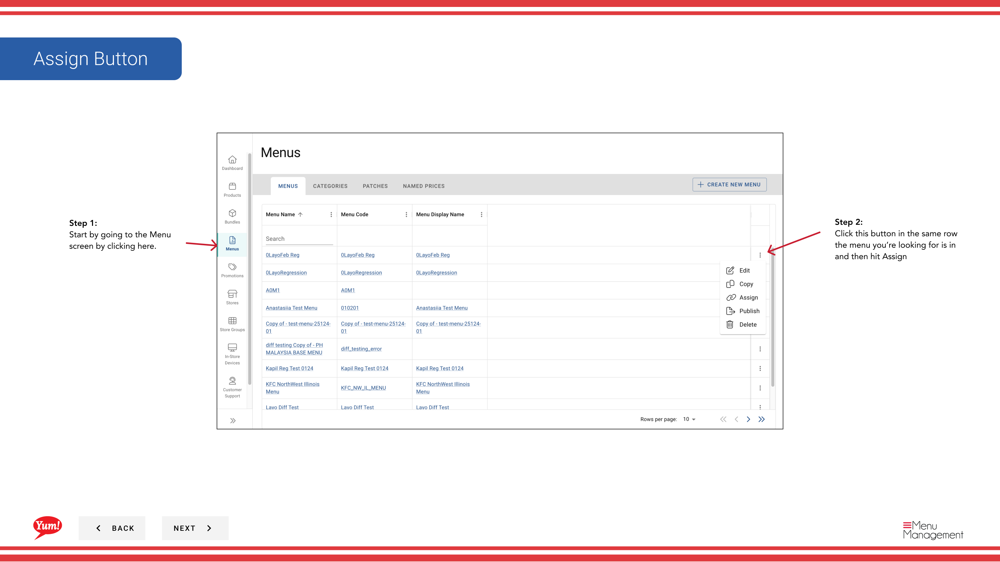
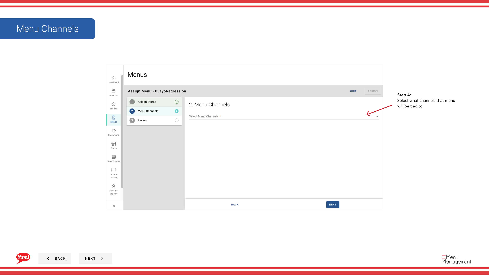
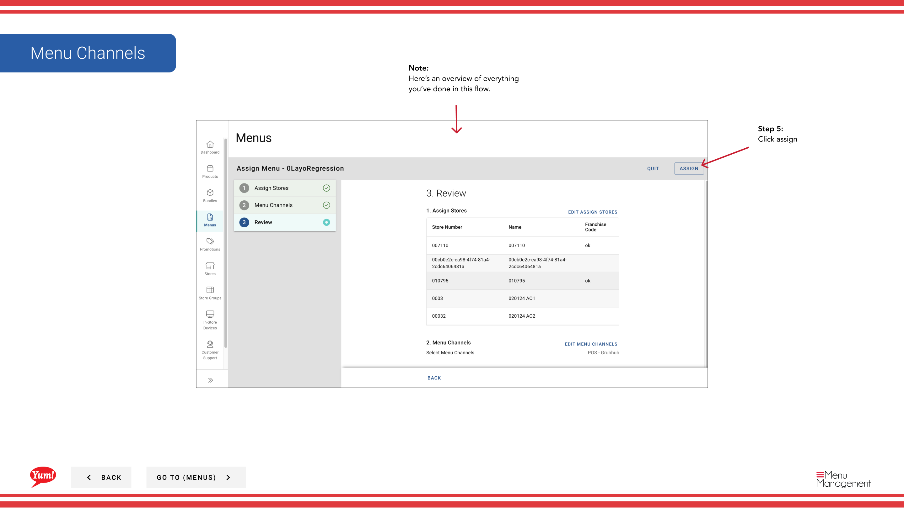

# Attribuer un menu

## Ce que ce guide couvre

Lier un menu à des magasins spécifiques et des canaux de commande afin que le bon catalogue soit servi aux clients.

## Étapes

**Step 1:** Naviguez dans la section **Menus** en utilisant le menu de navigation de gauche.

**Step 2:** Trouvez le menu à attribuer dans la liste des menus, cliquez sur le menu **action** (trois points) dans la même ligne, et sélectionnez **Assign**.

**Step 3:** Sur l'étape **Stores**, sélectionnez les magasins ou groupes de magasins qui utiliseront ce menu. Vous pouvez rechercher et filtrer par groupe de magasins si nécessaire.

| Champ | Quoi entrer | Annexe |
|-------|--------------|-------|
| **Tâches** * | Sélectionnez un ou plusieurs magasins | Utilisez la recherche pour trouver des magasins spécifiques, ou sélectionnez des groupes de magasins entiers. Seuls les magasins sélectionnés recevront ce menu. |

**Step 4:** À l'étape **channels**, sélectionnez les canaux de commande auxquels ce menu sera lié (p. ex. web, mobile, plateformes de livraison). Vous pouvez sélectionner plusieurs canaux.

| Champ | Quoi entrer | Annexe |
|-------|--------------|-------|
| **Channels** * | Sélectionnez un ou plusieurs canaux | Choisissez tous les canaux où les clients devraient voir ce menu. Le menu n'apparaîtra que sur les canaux sélectionnés. |

**Step 5:** Passez en revue vos sélections sur l'onglet **Résumé** pour confirmer les magasins et les canaux, puis cliquez sur **Assigner** pour enregistrer.

:::note :
Le menu n'apparaîtra pas immédiatement dans les magasins. Vous devez publier le menu pour le rendre en direct sur les canaux sélectionnés.
:::

## Guides connexes

- [Publier un menu](/docs/admin-portal-guide/menus/publish-a-menu/)— Faire le menu assigné en direct sur les canaux de commande
- [Modifier un menu](/docs/admin-portal-guide/menus/edit-a-menu/)— Mettre à jour le menu avant de l'assigner aux magasins

---

* Une partie des[Guide du portail administratif](/docs/admin-portal-guide)· Section : Menus*