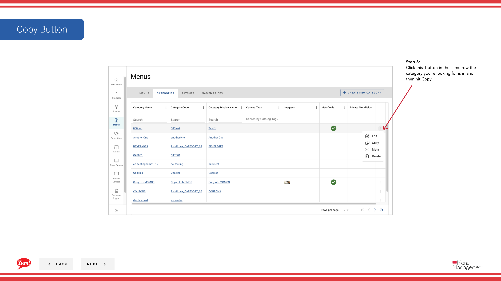

# Copier une catégorie

## Ce que ce guide couvre

Dupliquer une catégorie existante pour accélérer la structuration des menus sans avoir à la recréer à partir de zéro.

## Étapes

**Step 1:** Naviguez dans la section **Menus** en utilisant le menu de navigation de gauche.

**Step 2:** Cliquez sur le dossier **Catégories** pour afficher toutes les catégories.

**Step 3:** Trouvez la catégorie que vous voulez copier, cliquez sur le menu **action** (trois points) dans la même ligne, et sélectionnez **Copie**.

**Step 4:** Le formulaire de catégorie apparaîtra avec les champs préremplis de l'original. Mettre à jour les champs requis :

| Champ | Quoi entrer | Annexe |
|-------|--------------|-------|
| **Code de catégorie** * | Un identifiant unique pour la nouvelle catégorie | Utiliser des lettres majuscules et des tirets, par exemple,`CAT-CHICKEN-GRILLED`. Doit être différent de l'original. Impossible de changer après la création. |
| **Nom de la catégorie** * | Le nom de l'affichage de cette catégorie | Par exemple, "Grilled Chicken". Changement par rapport à l'original si nécessaire. Présenté aux clients dans le menu. |
| **Afficher le nom** | Autre nom facultatif | Copie d'origine mais peut être mise à jour. |
| **Description** | Notes internes facultatives | Copie d'origine mais peut être mise à jour. |
| **Heures disponibles** | Fenêtre temporelle optionnelle | Copie d'origine mais peut être mise à jour. |

Toute la configuration de la catégorie d'origine (réglages d'affichage, heures de disponibilité, étiquettes) est copiée automatiquement.

**Step 5:** Cliquez sur **Créer** pour enregistrer la catégorie copiée.

:::note :
La catégorie copiée aura la même configuration que l'original mais avec un nouveau code de catégorie unique. Vous pouvez le modifier plus loin après la création si nécessaire.
:::

## Guides connexes

- [Modifier une catégorie](/docs/admin-portal-guide/menus/edit-a-category/)— Modifier la catégorie copiée
- [Créer une catégorie](/docs/admin-portal-guide/menus/create-a-category/)— Créer une nouvelle catégorie à partir de zéro
- [Supprimer une catégorie](/docs/admin-portal-guide/menus/delete-a-category/)— Supprimer une catégorie

---

* Une partie des[Guide du portail administratif](/docs/admin-portal-guide)· Section : Menus*