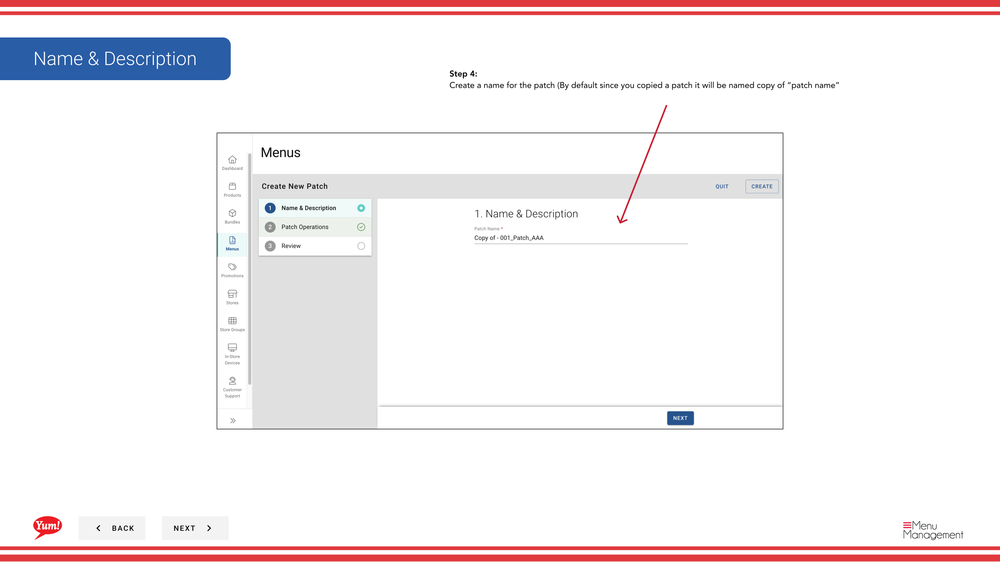

# Copier un patch

## Ce que ce guide couvre

Dupliquer un patch existant pour l'utiliser comme point de départ d'un ensemble de remplacements similaires.

## Étapes

**Step 1:** Naviguez dans la section **Menus** en utilisant le menu de navigation de gauche.

**Step 2:** Cliquez sur l'onglet **Patches** pour voir tous les correctifs.

**Step 3:** Trouvez le patch que vous voulez copier, cliquez sur le menu **action** (trois points) dans la même ligne, et sélectionnez **Copie**.

**Step 4:** Mettre à jour le nom du patch. Par défaut, le système l'appellera "copie de [nom du correctif original]".

| Champ | Quoi entrer | Annexe |
|-------|--------------|-------|
| **Nom du lot** | Un nom descriptif pour ce nouveau patch | Par exemple, «Sydney Q2 Price Override» (copié de «Sydney Q1 Price Override»). Changez le nom pour refléter ce patch. |

Toutes les opérations et les éléments du patch original sont copiés automatiquement.

**Step 5:** Consultez les opérations copiées pour vous assurer qu'elles correspondent à vos besoins. Vous pouvez modifier, réorganiser, ajouter ou supprimer des opérations avant d'enregistrer.

**Step 6:** Cliquez sur **Créer** pour enregistrer le patch copié.

:::note :
Le patch copié est indépendant de l'original. Les modifications apportées à un patch n'affecteront pas l'autre. Modifier le patch copié après la création si vous devez modifier les opérations ou les éléments.
:::

## Guides connexes

- [Modifier un lot](/docs/admin-portal-guide/menus/edit-a-patch/)— Modifier les opérations de patchs copiés
- [Supprimer un lot](/docs/admin-portal-guide/menus/delete-a-patch/)— Supprimer un patch
- [Attribuer un lot (Ajouter à la liste des lots)](/docs/admin-portal-guide/menus/assign-a-patch-add-to-patch-list/)— Assigner ce patch aux magasins

---

* Une partie des[Guide du portail administratif](/docs/admin-portal-guide)· Section : Menus*