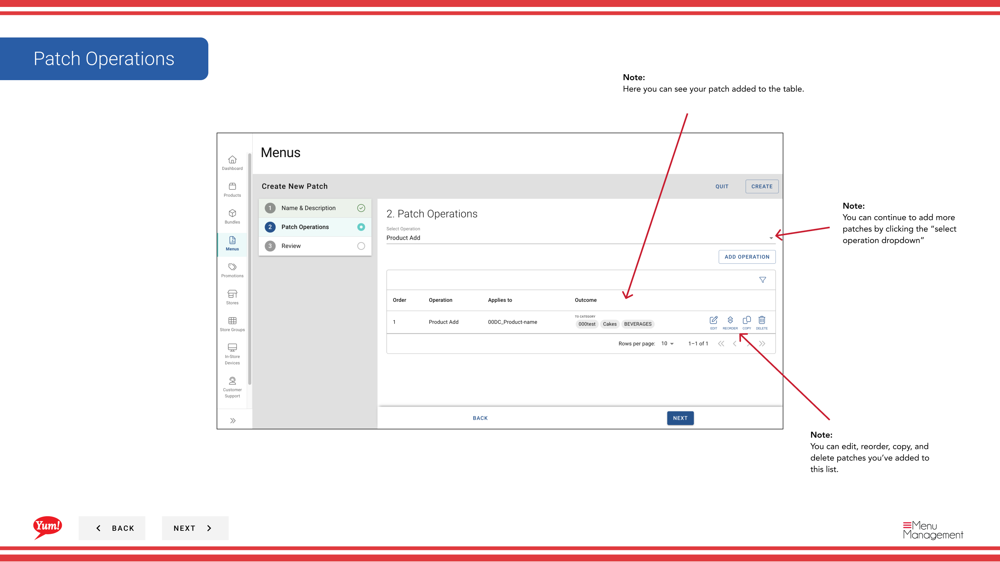
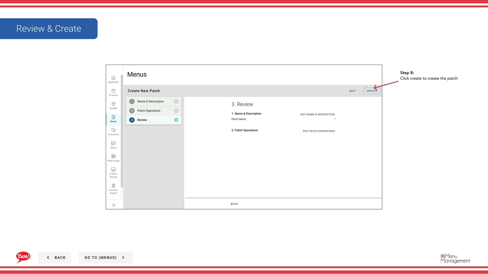

# Créer un patch

## Ce que ce guide couvre

Crée un correctif de menu — une priorité ciblée qui modifie des éléments spécifiques (produits, paquets ou variantes) dans un menu sans remplacer le menu entier. Utilisé couramment pour les changements de prix localisés ou de disponibilité régionale.

## Étapes

**Step 1:** Naviguez dans la section **Menus** en utilisant le menu de navigation de gauche.

**Step 2:** Cliquez sur l'onglet **Patches** pour voir tous les correctifs.

**Step 3:** Cliquez sur le bouton **Créer un nouveau patch**.

**Step 4:** Saisissez un nom descriptif pour le patch. Les champs marqués d'un * sont obligatoires.

| Champ | Quoi entrer | Annexe |
|-------|--------------|-------|
| **Nom du lot** * | Un nom descriptif pour ce que ce patch change | p.ex., prix supérieur à la norme Q1 de Sydney, menu de disponibilité de Halal Fix, rabais de promo régional. Utilisé pour identifier le patch dans les listes. |

**Step 5:** Sélectionnez une opération **** dans le menu déroulant. Cela définit le type de changement que le patch fera.

| Fonctionnement | Objet |
|-----------|---------|
| Dépassement des prix | Modifier le prix des articles spécifiques |
| Dépassement de la disponibilité | Activer ou désactiver des éléments à certains moments |
| Item Activer/désactiver | Activer ou désactiver les éléments |
| Autres opérations sur mesure | Dépend de la configuration de votre système |

**Step 6:** Après avoir sélectionné une opération, cliquez sur **Ajouter une opération** pour procéder.

**Step 7:** Recherchez et sélectionnez les produits, variantes ou paquets spécifiques auxquels cette opération s'applique. Une fois que vous avez sélectionné tous les éléments nécessaires, cliquez sur **Ajouter Opération** pour les enregistrer.

**Step 8:** Vous pouvez ajouter plus d'opérations au même patch en répétant **Étapes 5–7**. Chaque opération permet de regrouper les changements liés.

**Step 9:** Une fois que vous avez ajouté toutes les opérations, cliquez sur **Créer** pour enregistrer le patch.

:::tip
Vous pouvez ajouter plusieurs opérations à un seul patch pour regrouper les modifications liées. Par exemple, vous pouvez créer un patch qui comprend à la fois les surtaxes de prix et les changements de disponibilité pour une promotion régionale.
:::

:::note :
Les patchs ne sont pas encore appliqués aux magasins. Après la création d'un patch, vous devez l'assigner aux magasins en utilisant les guides de Patch.
:::

## Guides connexes

- [Modifier un lot](/docs/admin-portal-guide/menus/edit-a-patch/)— Mettre à jour les opérations ou les éléments d'un patch
- [Copier un patch](/docs/admin-portal-guide/menus/copy-a-patch/)— Dupliquer un patch comme point de départ
- [Attribuer un lot (Ajouter à la liste des lots)](/docs/admin-portal-guide/menus/assign-a-patch-add-to-patch-list/)— Ajouter ce correctif à une liste active de magasins
- [Supprimer un lot](/docs/admin-portal-guide/menus/delete-a-patch/)— Supprimer un patch

---

* Une partie des[Guide du portail administratif](/docs/admin-portal-guide)· Section : Menus*