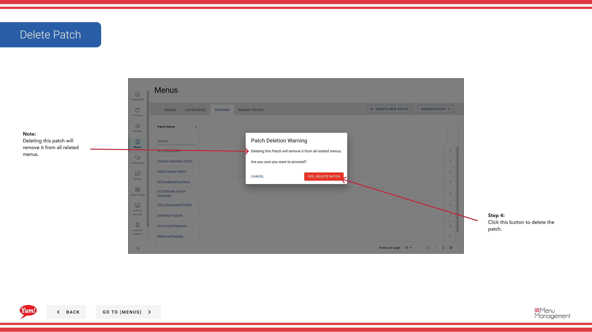

# Supprimer un lot

## Ce que ce guide couvre

Enlève définitivement un patch du système.

## Étapes

**Step 1:** Naviguez dans la section **Menus** en utilisant le menu de navigation de gauche.

**Step 2:** Cliquez sur l'onglet **Patches** pour voir tous les correctifs.

**Step 3:** Trouvez le patch que vous voulez supprimer, cliquez sur le menu **action** (trois points) dans la même ligne, et sélectionnez **Supprimer**.

**Step 4:** Une boîte de dialogue de confirmation apparaîtra. Cliquez sur **Supprimer** pour supprimer définitivement le patch.

:::caution
Supprimer un patch le supprimera de tous les magasins où il est activement assigné. Si le patch est dans une liste de patchs store, il sera supprimé de cette liste. Cette action ne peut être annulée.
:::

## Guides connexes

- [Copier un patch](/docs/admin-portal-guide/menus/copy-a-patch/)— Créer une copie de sauvegarde avant de supprimer
- [Modifier un lot](/docs/admin-portal-guide/menus/edit-a-patch/)— Modifier un patch au lieu de le supprimer

---

* Une partie des[Guide du portail administratif](/docs/admin-portal-guide)· Section : Menus*