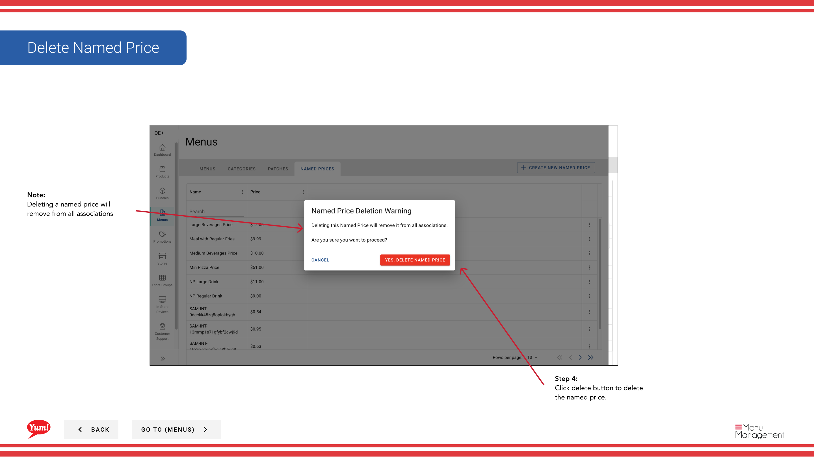

# Supprimer Prix Nommé

## Ce que ce guide couvre

Supprime définitivement un prix nommé qui n'est plus utilisé. Supprime l'étiquette du prix uniquement — les produits qui l'utilisent doivent être réaffectés à un prix différent.

## Étapes

**Step 1:** Naviguez dans la section **Menus** en utilisant le menu de navigation de gauche.

**Step 2:** Cliquez sur l'onglet **Prix nommés** pour afficher tous les prix nommés.

**Step 3:** Trouvez le prix à supprimer dans la liste. Vous pouvez utiliser la boîte de recherche pour la localiser ou ajuster le nombre de résultats affichés par page.

**Step 4:** Cliquez sur le menu **action** (trois points) dans la même ligne, puis sélectionnez **Supprimer**.

**Step 5:** Une boîte de dialogue de confirmation apparaîtra. Cliquez sur le bouton **Supprimer** pour supprimer définitivement le prix nommé.

:::caution
La suppression d'un prix nommé le supprimera de tous les produits et variantes qui l'utilisent. Les produits devront être réaffectés à un prix déterminé différent ou à une valeur directe. Cette action ne peut être annulée. Avant de supprimer, considérez quels produits utilisent ce prix.
:::

## Guides connexes

- [Créer un prix nommé](/docs/admin-portal-guide/menus/create-a-named-price/)— Créer un prix nominatif de remplacement si nécessaire
- [Modifier le prix nommé](/docs/admin-portal-guide/menus/edit-named-price/)— Mettre à jour un prix nommé au lieu de le supprimer

---

* Une partie des[Guide du portail administratif](/docs/admin-portal-guide)· Section : Menus*