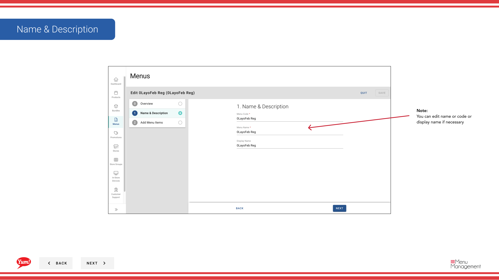

# Modifier un menu

## Ce que ce guide couvre

Mettre à jour une configuration existante de menus, comme son nom, les éléments assignés ou la structure de catégorie.

## Étapes

**Step 1:** Naviguez dans la section **Menus** en utilisant le menu de navigation de gauche.

**Step 2:** Trouvez le menu que vous voulez modifier dans la liste des menus, cliquez sur le menu **action** (trois points) dans la même ligne, et sélectionnez **Edit**.

**Step 3:** Dans l'onglet Aperçu, vous pouvez afficher ou modifier les champs suivants :

| Champ | Quoi entrer | Annexe |
|-------|--------------|-------|
| **Nom de famille** | Un nom lisible par l'homme pour ce menu | Par exemple, "Australia Breakfast Menu 2024". Afficher dans la liste des menus et lors de l'attribution des menus aux magasins. |
| **Code ménu** | L'identificateur unique du système | Affichage seulement — ne peut pas être changé après la création. |

**Step 4:** Ajouter ou supprimer des catégories en utilisant le menu déroulant **Ajouter des catégories** ou en faisant glisser des catégories pour les réorganiser. Pour supprimer une catégorie, cliquez sur l'icône **supprimer** à côté.

**Step 5:** Modifier le contenu de la catégorie en élargissant chaque catégorie et en utilisant le menu déroulant **Ajouter des produits/bundles** pour ajouter ou supprimer des éléments.

**Step 6:** Une fois que vous avez fait toutes les modifications, cliquez sur **Enregistrer** pour les appliquer.

:::note :
Tous les changements sont enregistrés dans cette version de menu. Ils n'apparaîtront pas dans les magasins à moins que le menu ne soit réaffecté et réédité.
:::

## Guides connexes

- [Publier un menu](/docs/admin-portal-guide/menus/publish-a-menu/)— Publier les modifications de menu aux canaux en direct
- [Attribuer un menu](/docs/admin-portal-guide/menus/assign-a-menu/)— Assigner ce menu aux magasins et aux chaînes
- [Copier un menu](/docs/admin-portal-guide/menus/copy-a-menu/)— Dupliquer ce menu pour créer une nouvelle version

---

* Une partie des[Guide du portail administratif](/docs/admin-portal-guide)· Section : Menus*