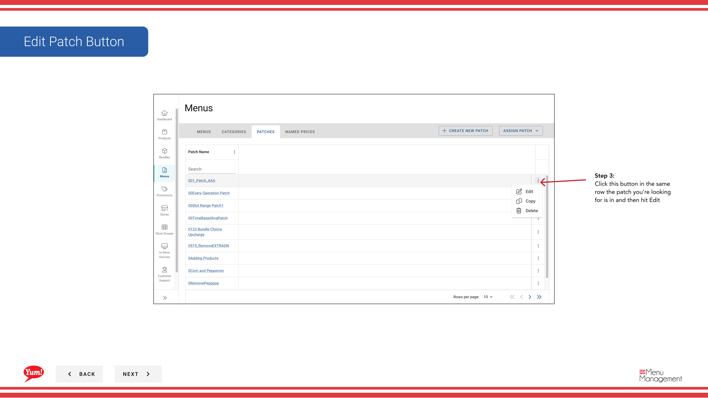
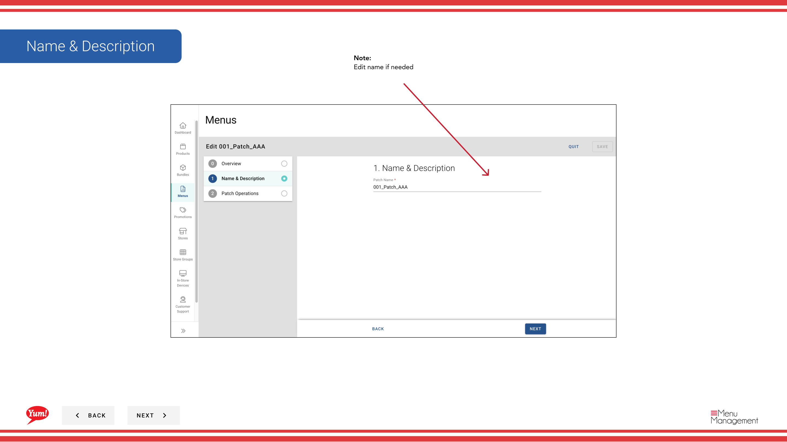

# Modifier un lot

## Ce que ce guide couvre

Mettre à jour un nom, des opérations ou des éléments de patchs existants.

## Étapes

**Step 1:** Naviguez dans la section **Menus** en utilisant le menu de navigation de gauche.

**Step 2:** Cliquez sur l'onglet **Patches** pour voir tous les correctifs.

**Step 3:** Trouvez le patch que vous souhaitez modifier, cliquez sur le menu **action** (trois points) dans la même ligne et sélectionnez **Edit**.

**Step 4:** Dans l'onglet Aperçu, vous pouvez mettre à jour le nom du patch.

| Champ | Quoi entrer | Annexe |
|-------|--------------|-------|
| **Nom du lot** | Un nom descriptif pour ce que ce patch change | p.ex., prix supérieur à la norme de prix de Sydney Q1, menu de disponibilité de Halal. Mettre à jour si la portée ou le but a changé. |

**Step 5:** Afficher et modifier les opérations dans la section **Opérations**. Vous pouvez :
- Modifier une opération en cliquant dessus et en mettant à jour les éléments ou paramètres
- Recommander les opérations en faisant glisser
- Copier une opération
- Supprimer une opération
- Ajouter de nouvelles opérations en cliquant sur **Ajouter opération**

**Step 6:** Une fois que vous avez fait toutes les modifications, cliquez sur **Enregistrer** pour les appliquer.

:::note :
Les modifications apportées à un patch n'affectent que les magasins où il est activement assigné. Les patchs qui ne sont pas encore assignés ou qui ont été retirés d'une liste de patchs de stockage ne seront pas affectés.
:::

## Guides connexes

- [Copier un patch](/docs/admin-portal-guide/menus/copy-a-patch/)— Dupliquer ce patch
- [Supprimer un lot](/docs/admin-portal-guide/menus/delete-a-patch/)— Supprimer ce patch
- [Attribuer un lot (Ajouter à la liste des lots)](/docs/admin-portal-guide/menus/assign-a-patch-add-to-patch-list/)— Assigner ce patch aux magasins

---

* Une partie des[Guide du portail administratif](/docs/admin-portal-guide)· Section : Menus*