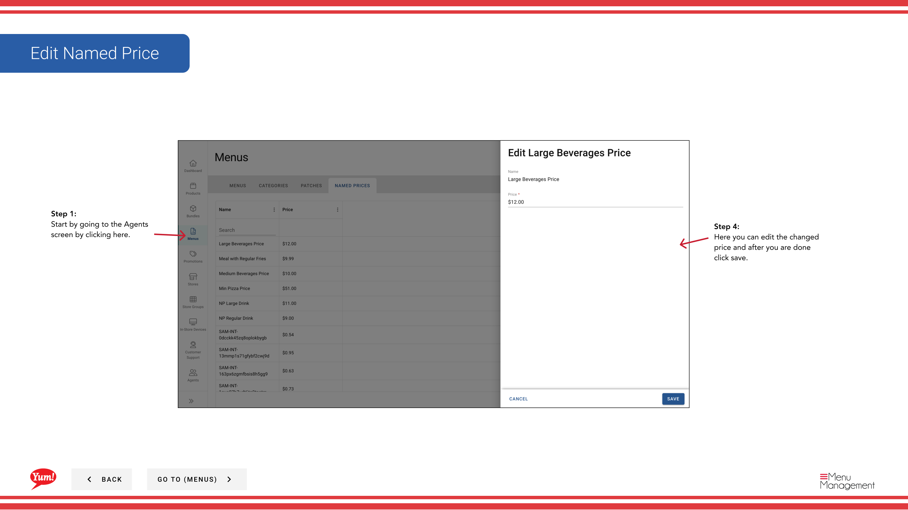

# Modifier le prix nommé

## Ce que ce guide couvre

Mise à jour d'une valeur ou d'un nom de prix. Tous les produits utilisant ce prix refléteront automatiquement la valeur actualisée.

## Étapes

**Step 1:** Naviguez dans la section **Menus** en utilisant le menu de navigation de gauche.

**Step 2:** Cliquez sur l'onglet **Prix nommés** pour afficher tous les prix nommés.

**Step 3:** Trouvez le prix à modifier dans la liste. Vous pouvez utiliser la boîte de recherche pour la localiser ou ajuster le nombre de résultats affichés par page.

**Step 4:** Cliquez sur le menu **action** (trois points) dans la même ligne, puis sélectionnez **Edit**.

**Step 5:** Mettre à jour les détails de prix nommés au besoin :

| Champ | Quoi entrer | Annexe |
|-------|--------------|-------|
| **Nom** | Une étiquette qui identifie ce point de prix | Par exemple, "Prix du déjeuner étudiant", "Prix de l'heure heureuse". Modifier si le but de ce prix a changé. |
| **Prix** | Le montant monétaire dans la monnaie de votre marché | Inscrivez uniquement les numéros — par exemple,`4.99`, `12.50`. Mise à jour pour refléter le nouveau prix. Tous les produits utilisant ce prix sont mis à jour automatiquement. |

**Step 6:** Une fois vos modifications effectuées, cliquez sur **Enregistrer** pour les appliquer.

:::note :
Lorsque vous mettez à jour un prix nommé, tous les produits et variantes utilisant ce prix sont mis à jour immédiatement. Le changement prend effet une fois que le menu est republié.
:::

## Guides connexes

- [Créer un prix nommé](/docs/admin-portal-guide/menus/create-a-named-price/)— Créer un nouveau prix nommé
- [Supprimer Prix Nommé](/docs/admin-portal-guide/menus/delete-named-price/)— Supprimer un prix indiqué

---

* Une partie des[Guide du portail administratif](/docs/admin-portal-guide)· Section : Menus*