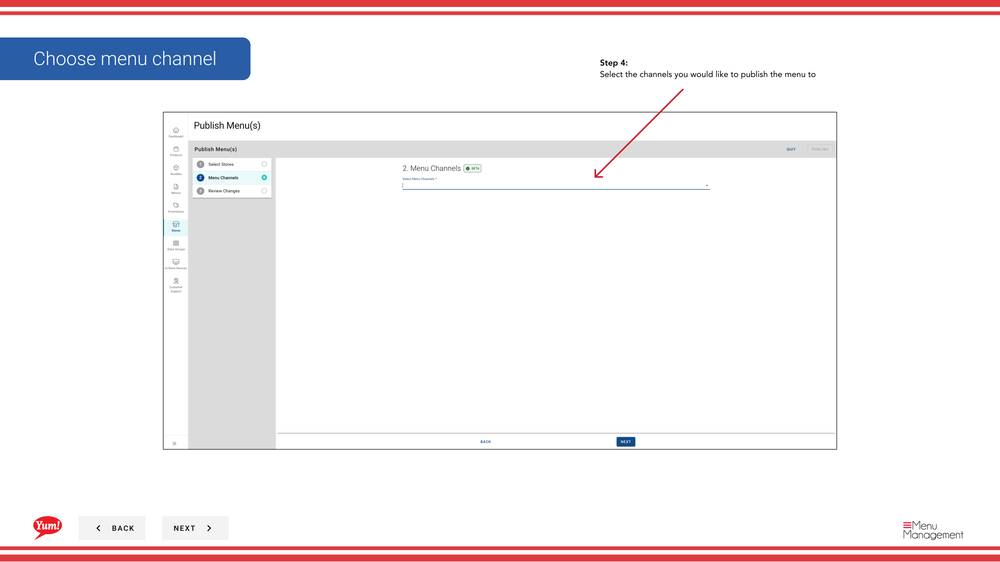
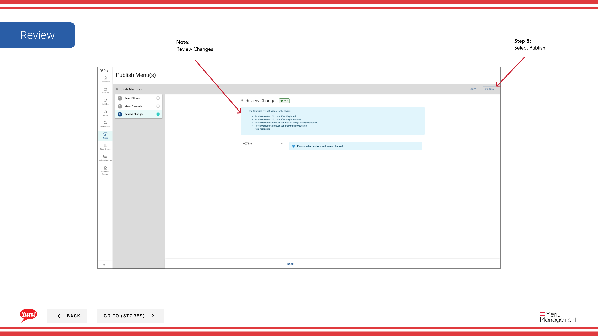

# Publier un menu

## Ce que ce guide couvre

Poussez un menu assigné aux canaux de commande numériques en direct. Ce processus met le menu à la disposition des clients pour la commande.

## Étapes

**Step 1:** Naviguez dans la section **Menus** en utilisant le menu de navigation de gauche.

**Step 2:** Trouvez le menu que vous souhaitez publier dans la liste des menus, cliquez sur le menu **action** (trois points) dans la même ligne, et sélectionnez **Publier**.

**Step 3:** Sur l'étape **Channels**, sélectionnez à quels canaux publier ce menu. Vous pouvez utiliser le **Select All** ou **Deselect Toutes** options pour basculer rapidement tous les canaux.

| Champ | Quoi entrer | Annexe |
|-------|--------------|-------|
| **Channels** * | Sélectionnez un ou plusieurs canaux | Choisissez les canaux où ce menu devrait aller en direct (p. ex. web, mobile, plateformes de livraison). Seuls les canaux sélectionnés recevront le menu. |

**Step 4:** Passez en revue vos sélections sur l'onglet **Résumé**, puis cliquez sur **Publier** pour pousser le menu en direct.

:::caution
La publication peut prendre quelques minutes. Consultez l'onglet Historique de la publication **** pour surveiller l'état de votre publication.
:::

:::note :
Vous ne pouvez publier que les menus qui ont été attribués aux magasins. Si un menu n'est pas encore assigné, assignez-le d'abord à l'aide du guide du menu.
:::

## Guides connexes

- [Attribuer un menu](/docs/admin-portal-guide/menus/assign-a-menu/)— Affecter un menu aux magasins et aux chaînes avant de publier
- [Modifier un menu](/docs/admin-portal-guide/menus/edit-a-menu/)— Mettre à jour le contenu du menu avant de publier les modifications

---

* Une partie des[Guide du portail administratif](/docs/admin-portal-guide)· Section : Menus*