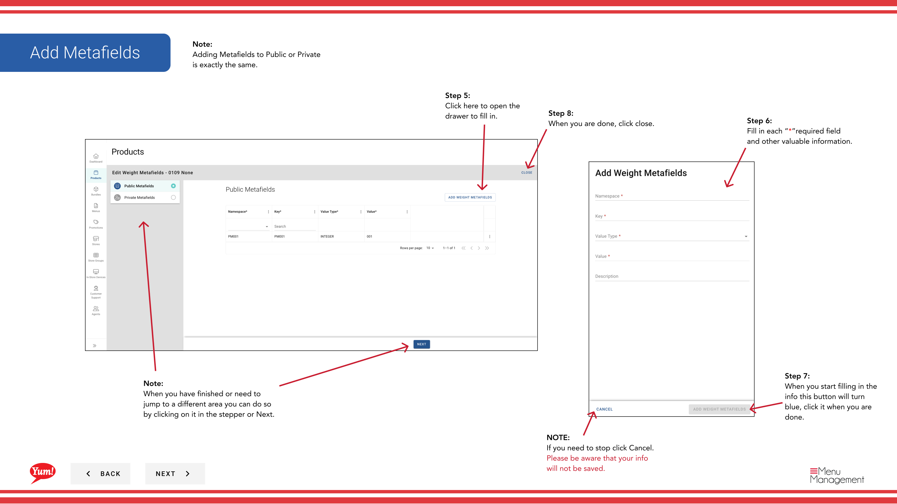
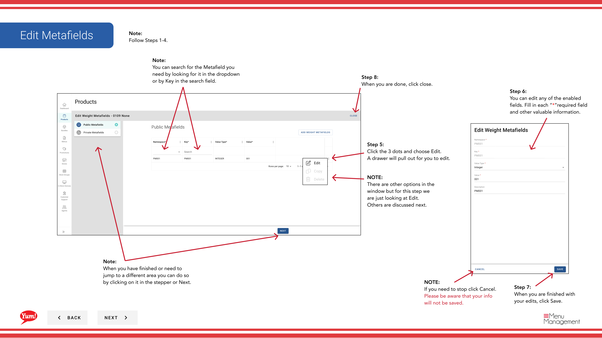

# Ajouter des Métafields à un poids

## Ce que ce guide couvre

Joindre les métadonnées personnalisées à une entrée de poids pour les besoins d'intégration du système ou les exigences spécifiques au marché.

## Étapes

**Step 1:** Naviguez dans la section **Produits** en utilisant le menu de navigation de gauche.

**Step 2:** Cliquez sur l'onglet **Poids**.

**Step 3:** Recherchez le poids en entrant le nom de poids ou le code de poids dans le champ de recherche.

**Step 4:** Cliquez sur le menu à trois points à côté du poids, puis sélectionnez **Meta**.

**Step 5:** Un tiroir ouvrira les sections de métachamp **Public** et **Private**.

**Step 6:** Cliquez sur le bouton **Ajouter** pour ajouter un nouveau métachamp.

**Step 7:** Remplissez chaque métachamp avec la clé exacte et la valeur que votre équipe technique a spécifiée.

### Modifier un champ de métadonnées existant

**Step 8:** Cliquez sur le menu à trois points à côté du métachamp que vous souhaitez modifier, puis sélectionnez **Edit**.

**Step 9:** Mettre à jour la clé et la valeur au besoin, puis cliquez sur **Enregistrer**.

### Copier un champ de métadonnées

**Step 10:** Cliquez sur le menu à trois points à côté du métachamp que vous voulez copier, puis sélectionnez **Copie**.

**Step 11:** Une nouvelle entrée métafield sera créée avec la même clé et la même valeur. Modifier si nécessaire.

### Pour supprimer un champ de métadonnées

**Step 12:** Cliquez sur le menu à trois points à côté du métachamp que vous voulez supprimer, puis sélectionnez **Supprimer**.

**Step 13:** Cliquez sur le bouton rouge **Supprimer** pour supprimer définitivement le métachamp.

**Step 14:** Lorsque vous avez terminé, cliquez sur **Fermer** pour fermer le tiroir.

## Annexe

:::caution
Ajouter des métachamps seulement si votre équipe technique a spécifié les clés et les valeurs exactes à utiliser. Les métachamps incorrects peuvent causer des défaillances d'intégration.
:::

:::tip
Vous pouvez rechercher des métachamps en regardant dans le menu déroulant ou en tapant le nom de la clé dans le champ de recherche.
:::

:::tip
Ajouter des métachamps à **Public** ou **Private** suit le même processus.
:::

:::caution
Supprimer un métachamp est permanent. Confirmez que vous supprimez la bonne entrée avant de cliquer sur Supprimer.
:::

---

* Une partie des[Guide du portail administratif](/docs/admin-portal-guide)· Section: Produits*