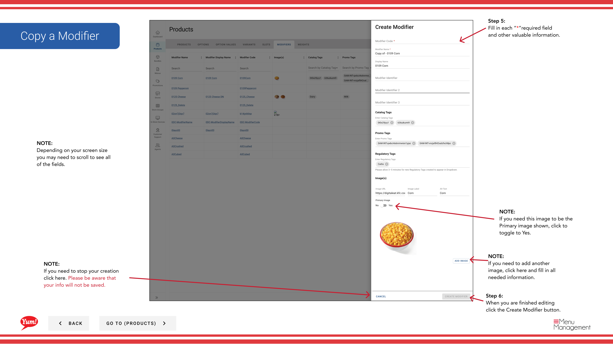

# Copier un modificateur

## Ce que ce guide couvre

Dupliquer un modificateur pour construire rapidement des add-ons similaires sans réentrer toutes les informations.

## Étapes

**Step 1:** Naviguez dans la section **Produits** en utilisant le menu de navigation de gauche.

**Step 2:** Cliquez sur l'onglet **Modificateurs**.

**Step 3:** Recherchez le modificateur que vous souhaitez copier en entrant le nom, le code ou la balise de catalogue dans le champ de recherche.

**Step 4:** Cliquez sur le menu à trois points à côté du modificateur, puis sélectionnez **Copier**.

**Step 5:** Le formulaire de copie apparaîtra avec les informations du modificateur original. Mettre à jour les champs au besoin. Les champs marqués d'un * sont obligatoires.

| Champ | Quoi entrer | Annexe |
|-------|--------------|-------|
| **Code de modification** * | Identifiant unique pour le nouveau modificateur | Doit être différent de l'original (p. ex. |
| **Nom de la modification** * | Nom indiqué aux clients | Peut être le même ou personnalisé |
| **Prix** | Frais supplémentaires pour ce modificateur | Entrez`0`s'il n'y a pas de frais supplémentaires |
| **Image** | Image en option pour ce modificateur | Basculer **Image principale** à Oui si nécessaire. Cliquez sur **Ajouter une autre image** pour ajouter plus. |

**Step 6:** Lorsque vous avez terminé l'édition, cliquez sur le bouton **Créer la modification**.

## Annexe

:::caution
Le code **Modifier** doit être unique. Vous ne pouvez pas utiliser le même code que le modificateur original.
:::

:::tip
Vous pouvez rechercher des modificateurs par nom, code ou étiquette de catalogue.
:::

:::caution
Cliquez sur **Annuler** rejette tous les changements non enregistrés.
:::

---

* Une partie des[Guide du portail administratif](/docs/admin-portal-guide)· Section: Produits*