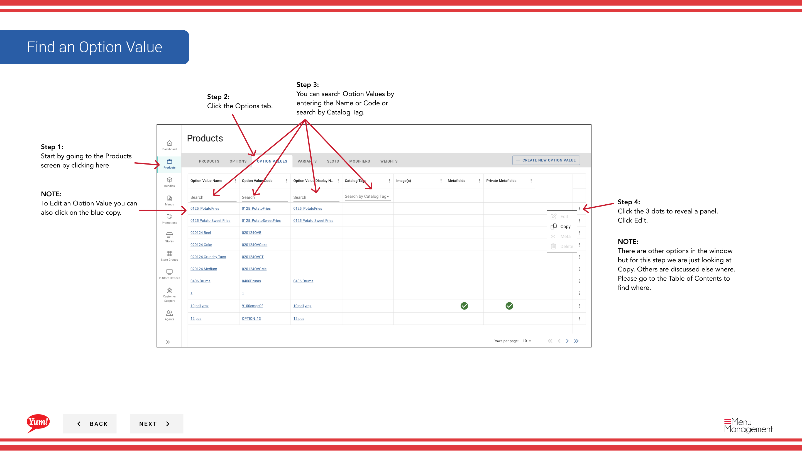
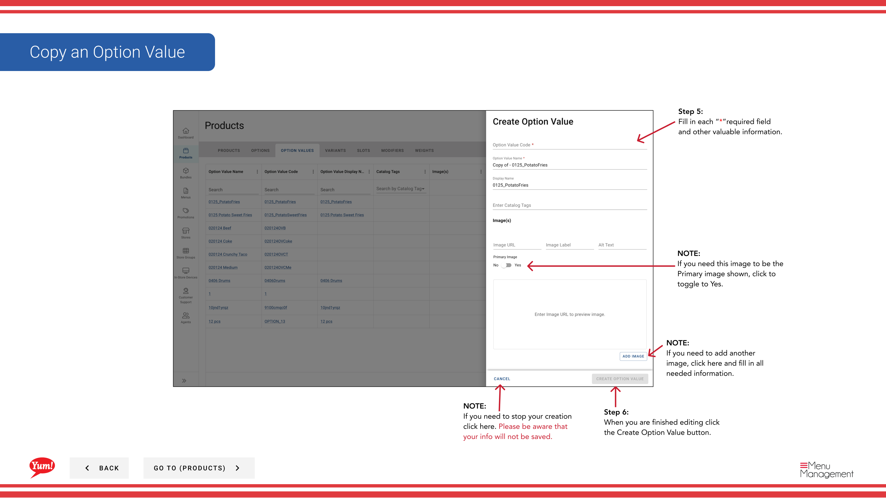

# Copier une valeur d'option

## Ce que ce guide couvre

Dupliquer une valeur d'option pour créer rapidement des choix similaires au sein d'un groupe d'options.

## Étapes

**Step 1:** Naviguez dans la section **Produits** en utilisant le menu de navigation de gauche.

**Step 2:** Cliquez sur l'onglet **Valeurs d'option**.

**Step 3:** Recherchez la valeur d'option que vous voulez copier en entrant le nom, le code ou l'étiquette de catalogue dans le champ de recherche.

**Step 4:** Cliquez sur le menu à trois points à côté de la valeur de l'option, puis sélectionnez **Copier**.

**Step 5:** Le formulaire de copie apparaîtra avec les informations de la valeur de l'option originale. Mettre à jour les champs au besoin. Les champs marqués d'un * sont obligatoires.

| Champ | Quoi entrer | Annexe |
|-------|--------------|-------|
| **Code de valeur d'option** * | Identifiant unique pour la nouvelle valeur | Doit être différent de l'original (p. ex. |
| **Nom de la valeur d'option** * | Le choix affiché aux clients | Peut être le même ou personnalisé |
| **Afficher le nom** | Étiquette plus courte pour un espace d'écran limité | Valeur par défaut du nom de l'option si elle est laissée en blanc |
| **Image** | Image en option pour ce choix | Basculer **Image principale** à Oui si nécessaire. Cliquez sur **Ajouter une autre image** pour ajouter plus. |

**Step 6:** Lorsque vous avez terminé l'édition, cliquez sur le bouton **Créer une valeur d'option**.

## Annexe

:::caution
Le **Code de valeur d'option** doit être unique. Vous ne pouvez pas utiliser le même code que la valeur de l'option originale.
:::

:::tip
Vous pouvez rechercher des valeurs d'option par nom, code ou étiquette de catalogue.
:::

:::caution
Cliquez sur **Annuler** rejette tous les changements non enregistrés.
:::

---

* Une partie des[Guide du portail administratif](/docs/admin-portal-guide)· Section: Produits*