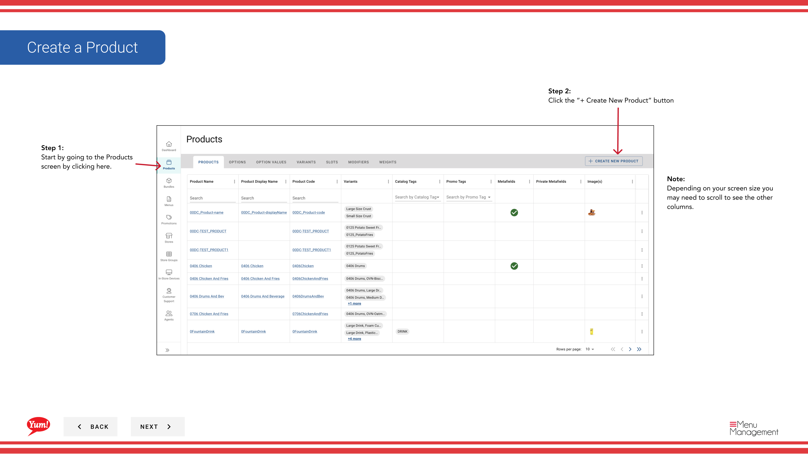

# Créer un produit

## Ce que ce guide couvre

Construit un produit complet à partir de zéro, définissant son code, son nom, ses variantes, ses options, ses prix, ses créneaux, ses modificateurs et ses fenêtres de disponibilité.

## Étapes

### Page 1: Informations de base sur le produit

**Step 1:** Naviguez dans la section **Produits** en utilisant le menu de navigation de gauche.

**Step 2:** Cliquez sur le bouton **+ Créer un nouveau produit**.

**Step 3:** Remplissez les détails du produit. Les champs marqués d'un * sont obligatoires.

| Champ | Quoi entrer | Annexe |
|-------|--------------|-------|
| **Code produit** * | Identifiant système unique pour ce produit | Utilisez les lettres majuscules, les nombres et les tirets seulement (p. ex. Impossible de changer après la création. |
| **Nom du produit** * | Nom d'affichage complet affiché aux clients | Par exemple, "Zinger Burger" |
| **Afficher le nom** | Nom abrégé pour espace d'écran limité | Par défaut vers le nom du produit si laissé vide |
| **Description** | Description du produit pour les clients | Gardez le clair et appétissant |
| **Disponibilité des articles** | Lorsque ce produit est disponible pour la commande | Cliquez pour ouvrir un tiroir et définir des fenêtres de temps (p. ex., "Breakfast" de 6h à 11h). Laisser en blanc pour toute la journée de disponibilité. |
| **Tags** | Étiquettes facultatives pour la déclaration et le filtrage | Entrez ou sélectionnez dans le menu déroulant |

**Step 4:** Cliquez sur **Suivant** pour passer à la page Options.

### Page 2: Options

**Step 5:** Ajouter des groupes de personnalisation (p. ex., Taille, Niveau d'espace) que les clients peuvent choisir lors de la commande.

| Champ | Quoi entrer | Annexe |
|-------|--------------|-------|
| **Options** | Groupes de personnalisation pour ce produit | Sélectionnez les options existantes dans la liste déroulante. Si l'option dont vous avez besoin n'existe pas, cliquez sur **Créer une nouvelle option**. |

**Step 6:** Pour réorganiser les options, cliquez et faites glisser la poignée de glisser six points pour les organiser dans l'ordre où vous voulez que les clients les voient.

**Step 7:** Pour supprimer une option, cliquez sur **X** à côté du nom de l'option.

**Step 8:** Cliquez sur **Suivant** pour passer à la page Variantes.

### Page 3: Variantes

**Step 9:** Définir chaque combinaison d'options purchasables (p. ex., Zinger Burger - Regular).

**Step 10:** Pour chaque variante, cliquez dans le champ **Variant Code** pour ouvrir la boîte d'édition, entrez un code unique (par exemple, « ZINGER-REGULAR »), puis cliquez sur **Enregistrer**. Cliquez sur **Annuler** supprimera le code.

**Step 11:** Pour définir une variante par défaut que les clients voient en premier, cliquez sur le menu déroulant **Variante par défaut** et sélectionnez la variante.

**Step 12:** Pour réorganiser les variantes, cliquez et faites glisser la poignée de glisser six points.

**Step 13:** Pour supprimer une variante, cliquez sur le menu à trois points à côté de la variante et sélectionnez **Supprimer**.

**Step 14:** Cliquez sur **Suivant** pour passer à la page Slots.

### Page 4: Fentes

**Step 15:** Ajouter des fentes (positions où les modificateurs peuvent être placés, p.ex., sélection de -Sauce, options de cheese).

**Step 16:** Sélectionnez des variantes (individuellement ou toutes) pour appliquer des créneaux.

**Step 17:** Cliquez sur **Appliquer des fentes en vrac** pour ajouter les mêmes fentes à plusieurs variantes sélectionnées à la fois. Ou cliquez sur **Edit** sur une variante spécifique pour ajouter des fentes à cette variante.

**Step 18:** Sélectionnez vos fentes dans le menu déroulant et cliquez sur **Ajouter**.

**Step 19:** Cliquez sur **Enregistrer** une fois terminé.

**Step 20:** Cliquez sur **Suivant** pour passer à la page Actions en vrac.

### Page 5: Actions collectives

**Step 21:** Ajouter les prix, les poids, la nutrition ou les exclusions aux variantes en vrac.

**Step 22:** Sélectionnez des variantes (individuelles ou toutes).

**Step 23:** Cliquez sur l'un de ces boutons d'action pour appliquer à toutes les variantes sélectionnées :
- **Ajouter le prix**: Entrez le prix de chaque variante. Pour utiliser une plage de prix, basculez **Range** à Oui et remplissez les valeurs min/max.
- **Ajouter des poids**: Entrez la valeur maximale du poids et sélectionnez le poids par défaut.
- **Ajouter nutrition**: Cliquez sur le menu à trois points > **Modifier** pour ajouter de l'information nutritionnelle.
- **Ajouter des exclusions**: Cochez toutes les cases d'exclusion allergène ou alimentaire qui s'appliquent.

**Step 24:** Cliquez sur **Enregistrer** dans chaque tiroir une fois terminé, ou **Annuler** pour supprimer les changements.

**Step 25:** Cliquez sur **Suivant** pour passer à la page Tags.

### Page 6: Variantes

**Step 26:** Ajouter des étiquettes optionnelles aux variantes pour signaler et filtrer.

**Step 27:** Cliquez sur **Ajouter** pour révéler les champs requis. Sélectionnez un **variante** dans la première liste déroulante, puis entrez ou sélectionnez une valeur de balise dans le deuxième champ.

**Step 28:** Cliquez à nouveau sur **Ajouter** pour ajouter plus de balises si nécessaire.

**Step 29:** Cliquez sur **Suivant** pour passer à la page Examen.

### Page 7 : Révision

**Step 30:** Examiner tous les détails saisis pour s'assurer qu'ils sont exacts. Utilisez les en-têtes de section bleue pour revenir à une page spécifique et apporter des corrections si nécessaire.

**Step 31:** Une fois satisfait, cliquez sur le bouton **Créer** pour enregistrer le produit.

## Annexe

:::caution
Cliquez sur **Annuler** à n'importe quelle étape rejette toutes les informations non enregistrées.
:::

:::tip
Vous pouvez sauter directement sur n'importe quelle page en cliquant sur l'en-tête de section bleue au lieu de cliquer **Suivant** à plusieurs reprises.
:::

:::tip
Si vous devez ajouter plus d'une image, vous pouvez le faire sur l'écran de modification de la variante après la création.
:::

:::tip
Si vous ne voyez pas l'option dont vous avez besoin dans le menu déroulant, cliquez sur **Créer une nouvelle option** pour la créer en premier.
:::

:::tip
Vous pouvez faire glisser et déposer des options et des variantes en utilisant les poignées de glisser à six points pour les réorganiser.
:::

---

* Une partie des[Guide du portail administratif](/docs/admin-portal-guide)· Section: Produits*