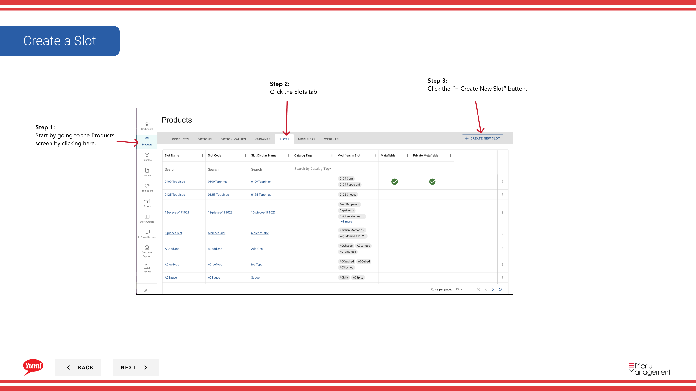

# Créer une Fente

## Ce que ce guide couvre

Crée une position au sein d'un produit où les modificateurs peuvent être placés (p. ex., Sélection de la sauce, Options de fromage), structurant comment les add-ons sont présentés aux clients.

## Étapes

### Étape 1: Informations de base sur la fente

**Step 1:** Naviguez dans la section **Produits** en utilisant le menu de navigation de gauche.

**Step 2:** Cliquez sur l'onglet **Slots**.

**Step 3:** Cliquez sur le bouton **+ Créer une nouvelle fente**.

**Step 4:** Remplissez les détails de la fente. Les champs marqués d'un * sont obligatoires.

| Champ | Quoi entrer | Annexe |
|-------|--------------|-------|
| ** Code du lot** * | Identifiant unique pour cette fente | Utiliser des lettres majuscules, des nombres et des tirets (p. ex. |
| ** Nom du lot** * | Décrit ce que la personnalisation cette fente offre | Par exemple, la sélection de sauce, les options de fromage |
| ** Quantité minimale** | Nombre minimal de sélections de modificateurs requis | 0 = facultatif |
| ** Quantité maximale** | Nombre maximal de sélections de modificateurs autorisées | Laisser blanc pour illimité |

**Step 5:** Lorsque vous avez terminé, cliquez sur **Suivant** pour passer à la page Modificateurs.

### Étape 2: Ajouter des modifications

**Step 6:** Sélectionnez tous les modificateurs nécessaires à cette fente dans la liste déroulante, puis cliquez sur **Ajouter** pour chacun.

**Step 7:** Si vous ne voyez pas le modificateur dont vous avez besoin, cliquez sur **Créer un nouveau modificateur** pour le créer d'abord.

**Step 8:** Pour réorganiser les modificateurs, cliquez et faites glisser la poignée de glisser à six points.

**Step 9:** Cliquez sur **Suivant** pour passer à la page Poids.

### Étape 3: Ajouter des poids

**Step 10:** Sélectionnez les options de poids (tailles de la portion) pour chaque modificateur dans la liste déroulante, puis cliquez sur **Ajouter**.

**Step 11:** Si plusieurs modificateurs partagent les mêmes poids, cochez la case **Appliquer à tous** pour attribuer ces poids à tous les modificateurs en même temps.

**Step 12:** Pour réorganiser les poids, cliquez et faites glisser la poignée de glisser six points.

**Step 13:** Cliquez sur **Créer** pour enregistrer la fente.

## Annexe

:::caution
Cliquez sur **Annuler** rejette toutes les informations non enregistrées.
:::

:::tip
Si vous ne voyez pas de modificateur nécessaire, cliquez sur **Créer un nouveau modificateur** pour l'ajouter avant de procéder.
:::

:::tip
Vous pouvez réarranger les modificateurs et les poids en utilisant les poignées à six points.
:::

:::tip
Utilisez **Appliquer à tous** pour attribuer rapidement les mêmes poids à plusieurs modificateurs à la fois.
:::

:::tip
Vous pouvez revenir aux étapes précédentes en cliquant sur **Retour** sans perdre d'informations.
:::

---

* Une partie des[Guide du portail administratif](/docs/admin-portal-guide)· Section: Produits*