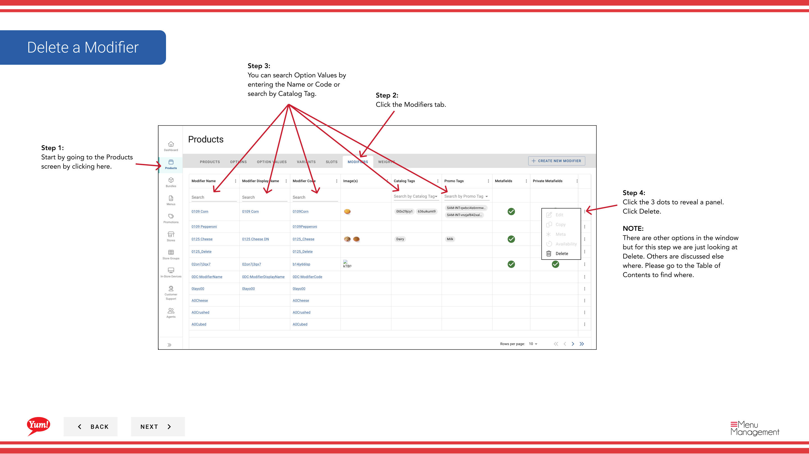

# Supprimer un modificateur

## Ce que ce guide couvre

Supprime définitivement un modificateur du système lorsqu'il n'est plus nécessaire.

## Étapes

**Step 1:** Naviguez dans la section **Produits** en utilisant le menu de navigation de gauche.

**Step 2:** Cliquez sur l'onglet **Modificateurs**.

**Step 3:** Recherchez le modificateur que vous souhaitez supprimer en entrant le nom, le code ou la balise de catalogue dans le champ de recherche.

**Step 4:** Cliquez sur le menu à trois points à côté du modificateur, puis sélectionnez **Supprimer**.

**Step 5:** Un modal de confirmation apparaîtra montrant toutes les zones du système où ce modificateur est utilisé. Passez en revue attentivement pour vous assurer que vous supprimez le correcteur.

**Step 6:** Cliquez sur le bouton rouge **Supprimer** pour supprimer définitivement le modificateur.

## Annexe

:::caution
La suppression d'un modificateur est permanente et ne peut être annulée. Le modificateur sera retiré de tous les emplacements et produits qui l'utilisent.
:::

:::tip
Vous pouvez rechercher des modificateurs par nom, code ou étiquette de catalogue pour trouver rapidement l'élément que vous voulez supprimer.
:::

:::caution
Cliquez sur **Annuler** si vous ne voulez pas procéder à la suppression.
:::

---

* Une partie des[Guide du portail administratif](/docs/admin-portal-guide)· Section: Produits*