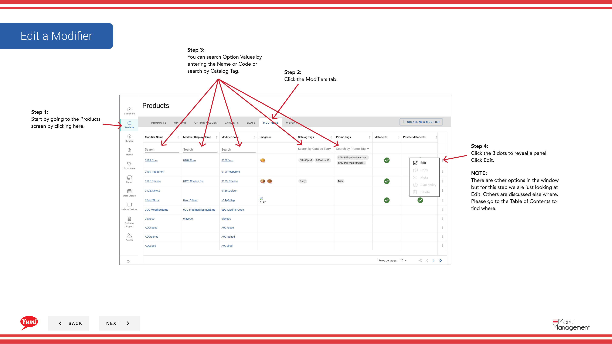

# Modifier un modificateur

## Ce que ce guide couvre

Mettre à jour les détails d'un modificateur tels que le nom, le prix, les images ou d'autres propriétés.

## Étapes

**Step 1:** Naviguez dans la section **Produits** en utilisant le menu de navigation de gauche.

**Step 2:** Cliquez sur l'onglet **Modificateurs**.

**Step 3:** Recherchez le modificateur que vous souhaitez modifier en entrant le nom, le code ou l'étiquette de catalogue dans le champ de recherche.

**Step 4:** Cliquez sur le menu à trois points à côté du modificateur, puis sélectionnez **Edit**.

**Step 5:** Mettre à jour les détails du modificateur. Les champs marqués d'un * sont obligatoires.

| Champ | Quoi entrer | Annexe |
|-------|--------------|-------|
| **Code de modification** * | identificateur unique | Impossible de changer après la création |
| **Nom de la modification** * | Nom indiqué aux clients | Par exemple, "Extra Cheese", "No Pickles", "Extra Sauce" |
| **Prix** | Frais supplémentaires pour ce modificateur | Entrez`0`s'il n'y a pas de frais supplémentaires |
| **Image** | Image en option pour ce modificateur | Basculer **Image principale** à Oui pour définir comme image principale d'affichage. Cliquez sur **Ajouter une autre image** pour ajouter plus. |

**Step 6:** Lorsque vous avez terminé l'édition, cliquez sur le bouton **Save**.

## Annexe

:::caution
Cliquez sur **Annuler** rejette tous les changements non enregistrés.
:::

:::tip
Basculer **Image principale** à **Oui** si cette image doit être l'image d'affichage principale de ce modificateur.
:::

:::tip
Vous pouvez ajouter plusieurs images en cliquant sur **Ajouter une autre image**.
:::

:::tip
Vous pouvez rechercher des modificateurs par nom, code ou étiquette de catalogue.
:::

---

* Une partie des[Guide du portail administratif](/docs/admin-portal-guide)· Section: Produits*