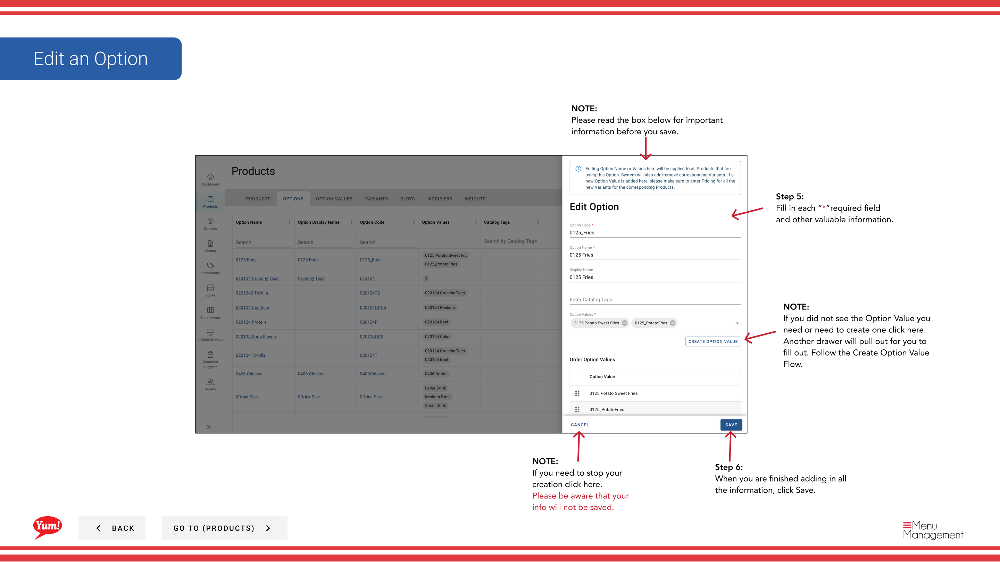

# Modifier une option

## Ce que ce guide couvre

Mettre à jour le nom ou la configuration d'une option existante pour refléter les modifications de menu ou d'UX.

## Étapes

**Step 1:** Naviguez dans la section **Produits** en utilisant le menu de navigation de gauche.

**Step 2:** Cliquez sur l'onglet **Options**.

**Step 3:** Recherchez l'option que vous souhaitez modifier en entrant le nom d'option, le code d'option ou l'étiquette de catalogue dans le champ de recherche.

**Step 4:** Cliquez sur le menu à trois points à côté de l'option, puis sélectionnez **Edit**.

**Step 5:** Mettez à jour les détails de l'option. Les champs marqués d'un * sont obligatoires.

| Champ | Quoi entrer | Annexe |
|-------|--------------|-------|
| **Code d'option** * | Identifiant unique pour cette option | Impossible de changer après la création |
| **Nom de l'option** * | Le nom de catégorie de personnalisation indiqué aux clients | Par exemple, Taille, Saveur, Niveau de vitesse |

**Step 6:** Pour ajouter ou gérer des valeurs d'option (les choix individuels dans cette option), cliquez sur **Ajouter une valeur d'option** ou gérer les valeurs existantes dans la section ci-dessous.

**Step 7:** Lorsque vous avez terminé vos modifications, cliquez sur **Enregistrer**.

## Annexe

:::caution
Cliquez sur **Annuler** rejette tous les changements non enregistrés.
:::

:::tip
Vous pouvez ajouter de nouvelles valeurs d'option en cliquant sur **Ajouter une valeur d'option**. Si vous avez besoin de créer une valeur d'option séparée, consultez le guide « Créer une valeur d'option ».
:::

:::tip
Vous pouvez rechercher des options par nom d'option, code d'option ou étiquette de catalogue.
:::

---

* Une partie des[Guide du portail administratif](/docs/admin-portal-guide)· Section: Produits*