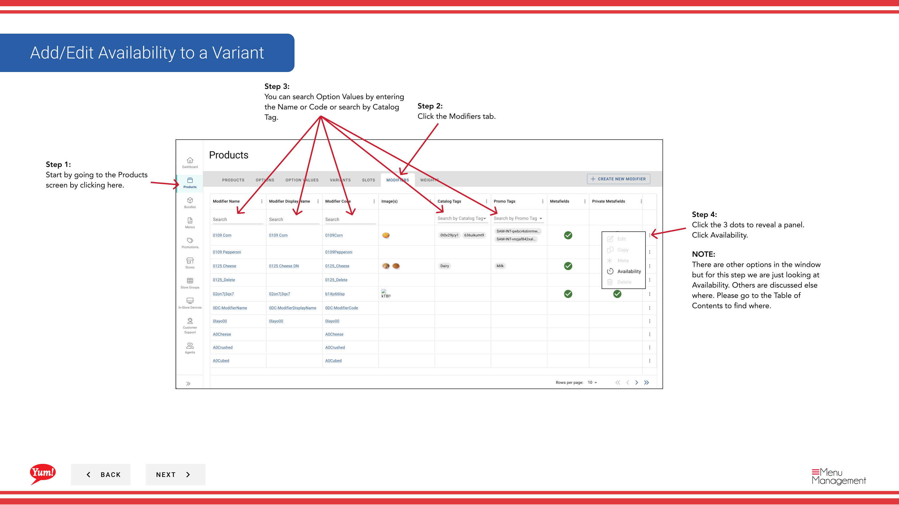
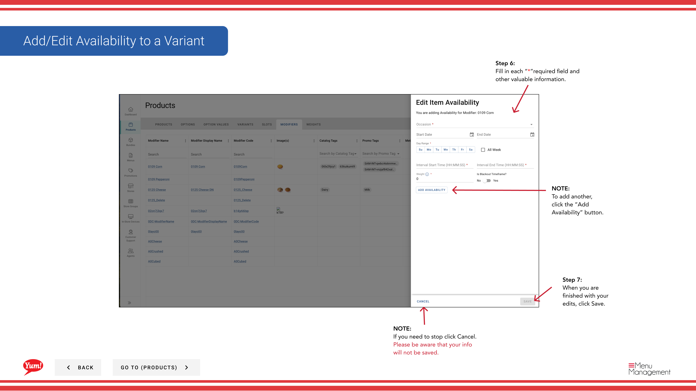

# Modifier la disponibilité de l'élément

## Ce que ce guide couvre

Définit des fenêtres de disponibilité en fonction du temps pour un produit ou un modificateur, contrôlant lorsqu'il apparaît sur le menu et est disponible pour la commande (p. ex.

## Étapes

**Step 1:** Naviguez dans la section **Produits** en utilisant le menu de navigation de gauche.

**Step 2:** Cliquez sur l'onglet **Modificateurs**.

**Step 3:** Recherchez le modificateur en entrant le nom, le code ou la balise de catalogue dans le champ de recherche.

**Step 4:** Cliquez sur le menu à trois points à côté du modificateur, puis sélectionnez **Disponibilité**.

**Step 5:** Un tiroir ouvrira des fenêtres de temps de disponibilité.

**Step 6:** Remplissez les détails de disponibilité pour chaque fenêtre de temps:

| Champ | Quoi entrer | Annexe |
|-------|--------------|-------|
| **Activités** | Lorsque cet article est disponible | Par exemple, "Breakfast", "Lunch", "Dîner" |
| **Heure de début** | Quand la disponibilité commence | Par exemple, 6 h 00 |
| **Heure de fin** | À la fin de la disponibilité | Par exemple, 11 h 00 (11 h 00) |

**Step 7:** Lorsque vous avez terminé vos modifications, cliquez sur **Enregistrer**.

**Step 8:** Pour ajouter une autre fenêtre de disponibilité, cliquez sur le bouton **Ajouter la disponibilité** et répétez les étapes 6-7.

## Annexe

:::caution
Cliquez sur **Annuler** rejette tous les changements non enregistrés.
:::

:::tip
Vous pouvez ajouter plusieurs fenêtres de disponibilité (p. ex., des périodes de petit déjeuner et de déjeuner séparées).
:::

:::tip
Laissez la section de disponibilité vide si l'article doit être disponible toute la journée.
:::

---

* Une partie des[Guide du portail administratif](/docs/admin-portal-guide)· Section: Produits*