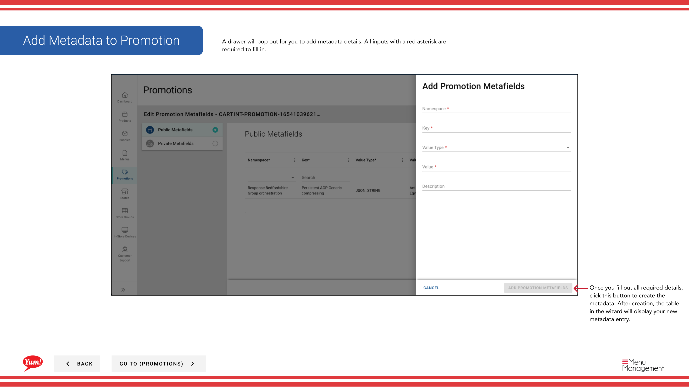

# Ajouter des métadonnées à la promotion

## Ce que ce guide couvre

Joindre des métadonnées personnalisées (paires de valeurs clés) à une promotion pour l'intégration du système ou les besoins de suivi spécifiques au marché.

## Étapes

**Step 1:** Naviguez dans la section **Promotions** en utilisant le menu de navigation de gauche.

**Step 2:** Trouvez la promotion que vous voulez mettre à jour. Cliquez sur le bouton de menu **action** (trois points), puis sélectionnez **Meta**.

**Step 3:** L'assistant de métadonnées s'ouvrira. Vous pouvez ajouter des métafields publics et privés.

**Step 4:** Pour ajouter un métachamp, cliquez sur le bouton **+ Ajouter un métachamp**. Entrez ce qui suit :

| Champ | Quoi entrer | Annexe |
|-------|--------------|-------|
| **Clé** | Nom du champ métadonnées | Par exemple, Campaign, région. Défini par votre équipe technique. |
| **Valeur** | La valeur de ce champ | Par exemple, CAMP123, APAC. Doit correspondre au format que vos intégrations attendent. |
| **Public/privé** | Basculer pour spécifier la visibilité | Les métadonnées publiques sont visibles pour les intégrations. Le privé est pour le suivi interne. |

**Step 5:** Cliquez sur le bouton **Enregistrer** pour appliquer les métadonnées.

:::note :
Ajouter des métadonnées seulement si votre équipe technique a spécifié les clés et valeurs exactes requises pour vos intégrations système. Les métadonnées servent à transmettre des données supplémentaires aux systèmes connectés.
:::

## Guides connexes

- [Créer une promotion](/docs/admin-portal-guide/promotions/create-a-promotion/)
- [Modifier une promotion](/docs/admin-portal-guide/promotions/edit-a-promotion/)

---

* Une partie des[Guide du portail administratif](/docs/admin-portal-guide)· Section : Promotions*