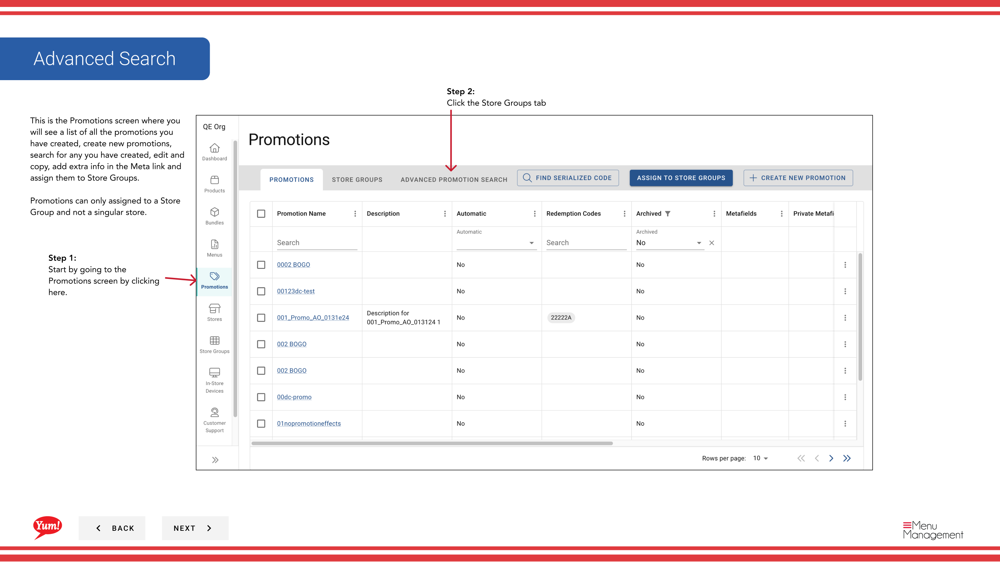
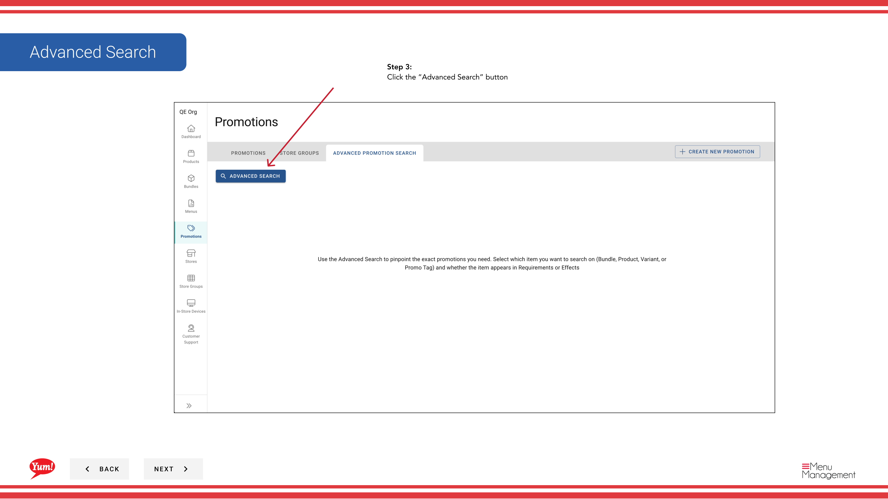
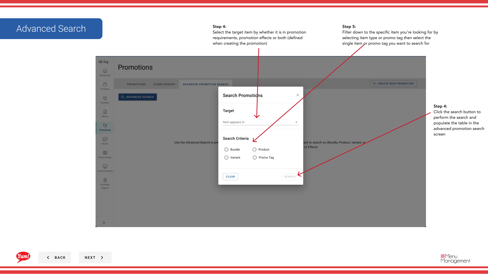

# Recherche avancée de promotions

## Ce que ce guide couvre

Fournit des capacités de filtrage et de recherche améliorées pour toutes les promotions, permettant aux opérateurs de localiser des promotions spécifiques selon des critères complexes – utiles pour rechercher toutes les promotions qui contiennent un élément, une étiquette ou une condition spécifique.

## Étapes

**Step 1:** Naviguez dans la section **Promotions** en utilisant le menu de navigation de gauche.

**Step 2:** Cliquez sur l'onglet **Store Groups**.

**Step 3:** Cliquez sur le bouton **Recherche avancée**.

**Step 4:** Sélectionnez où chercher votre élément cible en choisissant à partir de la liste déroulante :

| Option | Signification |
|--------|---------|
| **Exigences** | Rechercher seulement dans les conditions de promotion |
| **Effets** | Rechercher uniquement dans les effets promotionnels |
| ** Les deux** | Rechercher dans les exigences et les effets |

**Step 5:** Cliquez sur le bouton **Recherche** pour remplir le tableau de résultats.

**Step 6:** Affinez votre recherche en sélectionnant :

- **Type d'article** — Filtrer par le type d'article que vous recherchez
- **Étiquette promo** — Filtrer par étiquette promotionnelle

Sélectionnez ensuite l'élément ou l'étiquette que vous souhaitez rechercher.

**Step 7:** Examiner les résultats de la recherche. Le tableau affichera :

- **Nom de la promotion** — Le nom de la promotion correspondante
- **Description** — La description est entrée lors de la création de la promotion
- **Compte des lots** — Combien de fois l'article apparaît dans les exigences et/ou les effets

:::tip
Si aucun résultat n'est trouvé, essayez d'ajuster vos paramètres de recherche ou en utilisant différents types d'articles ou tags.
:::

## Guides connexes

- [Créer une promotion](/docs/admin-portal-guide/promotions/create-a-promotion/)
- [Modifier une promotion](/docs/admin-portal-guide/promotions/edit-a-promotion/)

---

* Une partie des[Guide du portail administratif](/docs/admin-portal-guide)· Section : Promotions*