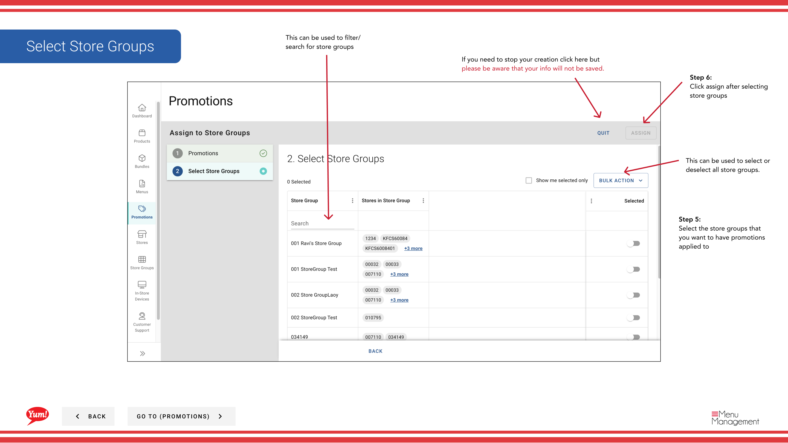

# Affecter des promotions aux groupes de magasins

## Ce que ce guide couvre

Relier les promotions existantes aux groupes de magasins, les rendant actives pour tous les magasins de ces groupes simultanément.

## Étapes

**Step 1:** Naviguez dans la section **Promotions** en utilisant le menu de navigation de gauche.

**Step 2:** Cliquez sur le bouton **Assigner les Promotions à Store Groups** (ou un bouton équivalent sur votre écran).

**Step 3:** Sélectionnez les promotions que vous souhaitez attribuer. Vous pouvez :

- **Cochez la case** à côté de chaque nom de promotion
- **Utilisez l'option "Tout sélectionner"** pour sélectionner toutes les promotions visibles (ou désélectionner en utilisant "Tout sélectionner")
- **Rechercher** pour des promotions spécifiques en utilisant la barre de recherche

**Step 4:** Une fois que vous avez sélectionné vos promotions, cliquez sur **Suivant** ou cliquez sur l'indicateur d'étape suivante pour procéder.

**Step 5:** Sélectionnez le ou les groupes de magasins qui devraient recevoir ces promotions. Vous pouvez :

- **Cochez la case** à côté du nom de chaque groupe de magasins
- **Rechercher** pour des groupes de magasins spécifiques en utilisant la barre de recherche

**Step 6:** Passez en revue vos sélections et cliquez sur le bouton **Assigner** pour appliquer les promotions aux groupes de magasins sélectionnés.

:::note :
Les promotions ne peuvent être attribuées qu'à des groupes de magasins, et non à des magasins individuels. Une fois affectées, les promotions deviennent actives immédiatement pour tous les magasins de ces groupes et sont affichées sur leurs canaux de commande numériques.
:::

:::tip
Vous pouvez également affecter des promotions à partir de la section Groupes Store. Voir[Affecter des promotions](/docs/admin-portal-guide/store-groups/assign-promotions/)pour ce flux de travail.
:::

## Guides connexes

- [Créer une promotion](/docs/admin-portal-guide/promotions/create-a-promotion/)
- [Créer un groupe de magasins](/docs/admin-portal-guide/promotions/create-a-store-group/)
- [Voir les promotions pour un groupe Store](/docs/admin-portal-guide/promotions/view-promotions-for-a-store-group/)
- [Affecter des promotions (section Groupes de marchandises)](/docs/admin-portal-guide/store-groups/assign-promotions/)

---

* Une partie des[Guide du portail administratif](/docs/admin-portal-guide)· Section : Promotions*