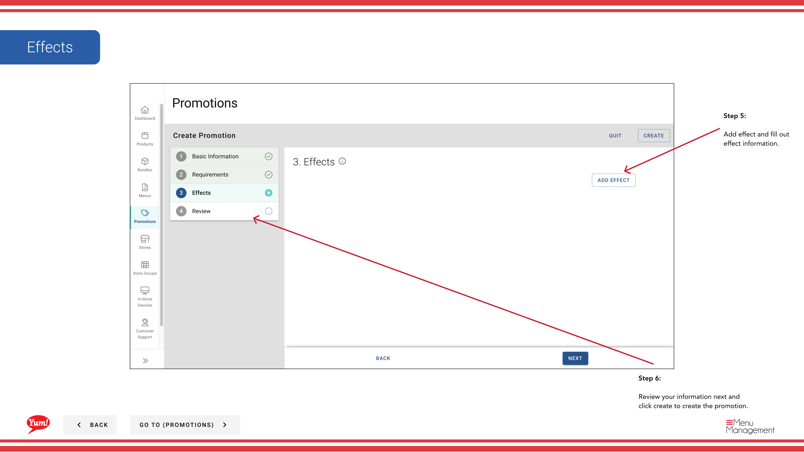

# Créer une promotion

## Ce que ce guide couvre

Constitue une nouvelle règle promotionnelle dans Atlas — définissant le type de rabais, les conditions, la période de validité et les groupes de magasins applicables — afin qu'elle puisse être diffusée aux clients par le biais des canaux de commande numériques.

## Étapes

**Step 1:** Naviguez dans la section **Promotions** en utilisant le menu de navigation de gauche.

**Step 2:** Cliquez sur le bouton **+ Créer une nouvelle promotion**.

**Step 3:** Remplissez les détails de la promotion. Les champs marqués d'un * sont obligatoires.

| Champ | Quoi entrer | Annexe |
|-------|--------------|-------|
| ** Nom de la promotion** * | Nom interne de cette promotion | Par exemple, «BOGO Zinger May 2024». Visible uniquement aux opérateurs. |
| **Afficher le nom** * | Nom du client affiché sur les canaux de commande | Par exemple, "Acheter 1 Obtenez 1 Zinger gratuit". Soyez bref et convaincant. |
| **Description** | Explique la promotion aux clients | Montré sur l'interface de commande. |

**Step 4:** Sélectionnez un **Promotion Flow** en fonction du type de promotion que vous créez.

| Débit | Utiliser quand... |
|------|-------------|
| ** Nouveau prix** | Vous souhaitez fixer un nouveau prix fixe pour un article admissible |
| **Acheter 1 Obtenez 1** | Le client achète un article et reçoit un autre gratuit ou réduit |
| **Prix réduit** | Vous voulez appliquer un pourcentage ou une réduction fixe |
| ** Promotion sur mesure** | La promotion ne correspond à aucun des flux ci-dessus |

**Step 5:** Ajouter **Exigences** — les conditions qu'un client doit remplir pour déclencher la promotion. En fonction de votre flux sélectionné, les exigences recommandées apparaîtront sous le sélecteur d'exigences. Cliquez sur **Ajouter** pour inclure une exigence recommandée, ou sélectionnez un type d'exigence dans le menu déroulant et cliquez sur **Ajouter une exigence** pour construire une condition personnalisée.

 

**Step 6:** Ajouter un **Effet** et remplir les détails de l'effet. L'effet définit le rabais ou la récompense que le client reçoit lorsque les exigences sont satisfaites.

**Step 7:** Vérifiez toutes les informations saisies et cliquez sur **Créer** pour enregistrer la promotion.

:::note :
Les promotions ne peuvent être attribuées qu'à un groupe **Store**, et non à un magasin individuel. Voir[Affecter des promotions aux groupes de magasins](/docs/admin-portal-guide/promotions/assign-promotions-to-store-groups/)après avoir créé votre promotion.
:::

## Guides connexes

- [Affecter des promotions aux groupes de magasins](/docs/admin-portal-guide/promotions/assign-promotions-to-store-groups/)
- [Copier une promotion](/docs/admin-portal-guide/promotions/copy-promotion/)

---

* Une partie des[Guide du portail administratif](/docs/admin-portal-guide)· Section : Promotions*