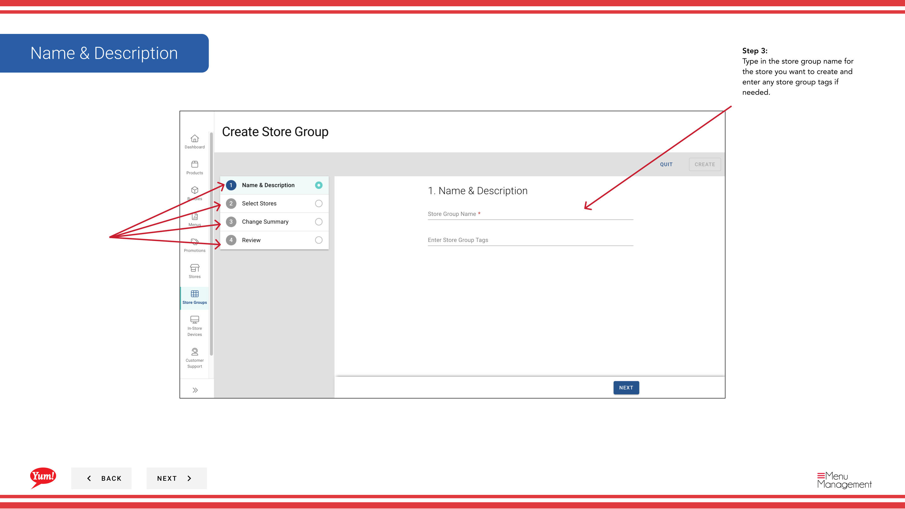

# Créer un groupe de magasins

## Ce que ce guide couvre

Crée un regroupement nommé de magasins qui partagent des configurations de menu, de promotion ou de taxe, une structure fondamentale pour gérer plusieurs emplacements à l'échelle. (Ce guide crée un groupe de magasins de la section Promotions. Vous pouvez également en créer un à partir de la section Groupes de magasins dans la navigation principale.)

## Étapes

**Step 1:** Naviguez dans la section **Promotions** en utilisant le menu de navigation de gauche.

**Step 2:** Cliquez sur l'onglet **Store Groups**.

**Step 3:** Cliquez sur le bouton **+ Créer un nouveau groupe de magasins**.

**Step 4:** Entrez les détails du groupe de magasins. Les champs marqués d'un * sont obligatoires.

| Champ | Quoi entrer | Annexe |
|-------|--------------|-------|
| ** Nom du groupe* * | Un nom descriptif pour ce groupe | Par exemple, Groupe Franchise NSW, Boutiques appartenant à l'entreprise, Pilote de petit-déjeuner 2024. Doit clairement se différencier des autres groupes. |
| **Store Group Tags** | Étiquettes facultatives pour le filtrage et la déclaration | Par exemple, pilote, société, franchise. Vous pouvez entrer plusieurs balises. |

**Step 5:** Sélectionnez des magasins à ajouter à ce groupe. Utilisez le tableau fourni pour trouver et sélectionner les magasins:

- Vous pouvez **filter par numéro de magasin, nom de magasin ou code de franchise** pour trouver rapidement des magasins spécifiques.
- **Toggle le commutateur** à côté de chaque nom de magasin pour l'ajouter au groupe.
- Un magasin peut appartenir à plusieurs groupes de magasins.

**Step 6:** Consultez le résumé de tous les magasins sélectionnés et les détails du groupe. Cliquez sur **Créer** pour enregistrer le groupe de magasins.

:::note :
Un magasin peut appartenir à plusieurs groupes de magasins. Les promotions, les règles fiscales et les menus sont tous gérés au niveau du groupe de magasins et s'appliquent à tous les magasins membres.
:::

## Guides connexes

- [Modifier un groupe de magasins](/docs/admin-portal-guide/promotions/edit-a-store-group/)
- [Affecter des promotions aux groupes de magasins](/docs/admin-portal-guide/promotions/assign-promotions-to-store-groups/)
- [Créer un groupe de magasins (à partir de la section Groupes de magasins)](/docs/admin-portal-guide/store-groups/create-a-store-group/)

---

* Une partie des[Guide du portail administratif](/docs/admin-portal-guide)· Section : Promotions*