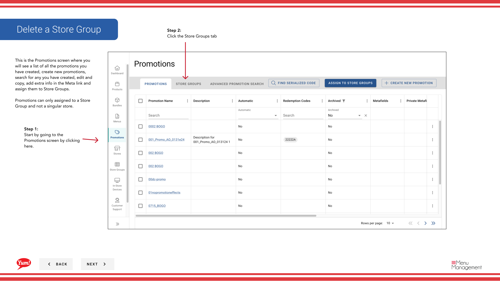
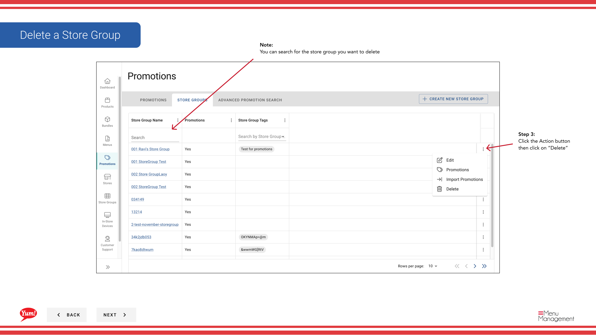

# Supprimer un groupe Store

## Ce que ce guide couvre

Enlève définitivement un groupe de magasins du système.

## Étapes

**Step 1:** Commencez par aller à l'écran Promotions en cliquant ici.
**Step 2:** Cliquez sur l'onglet Groupes de Store

**Step 3:** Cliquez sur le bouton Action puis cliquez sur Supprimer

**Step 4:** Cliquez pour supprimer

## Annexe

:::note :
Vous pouvez rechercher le groupe de magasins à supprimer
:::

:::note :
Vous pouvez annuler à tout moment si nécessaire
:::

:::note :
Toutes les règles fiscales et promotions liées aux magasins dans ce groupe de magasins seront supprimées si supprimé
:::

## Informations complémentaires

- Promotions - Supprimer un groupe de magasins
- C'est l'écran Promotions où vous verrez une liste de toutes les promotions que vous avez créées, créez de nouvelles promotions, recherchez celles que vous avez créées, modifiez et copiez, ajoutez des informations supplémentaires dans le lien Meta et assignez-les aux groupes Store. Les promotions ne peuvent être attribuées qu'à un groupe de magasins et non à un magasin singulier.

---

* Une partie des[Guide du portail administratif](/docs/admin-portal-guide)· Section : Promotions*