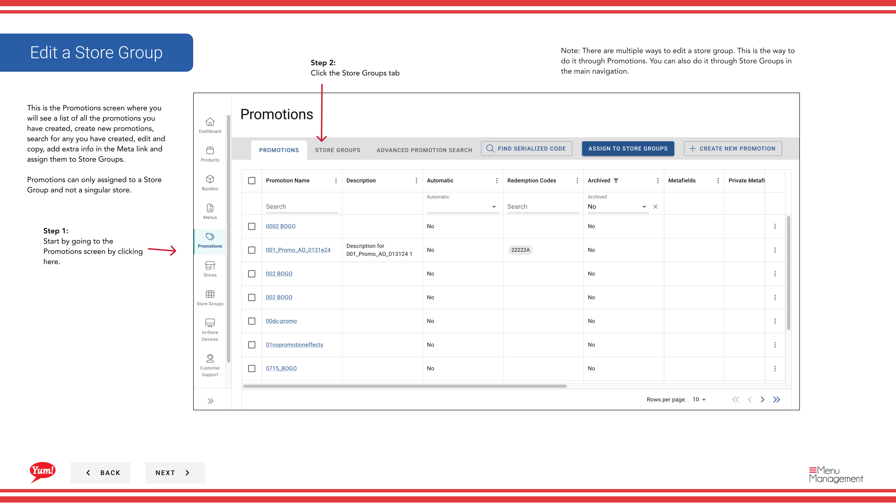
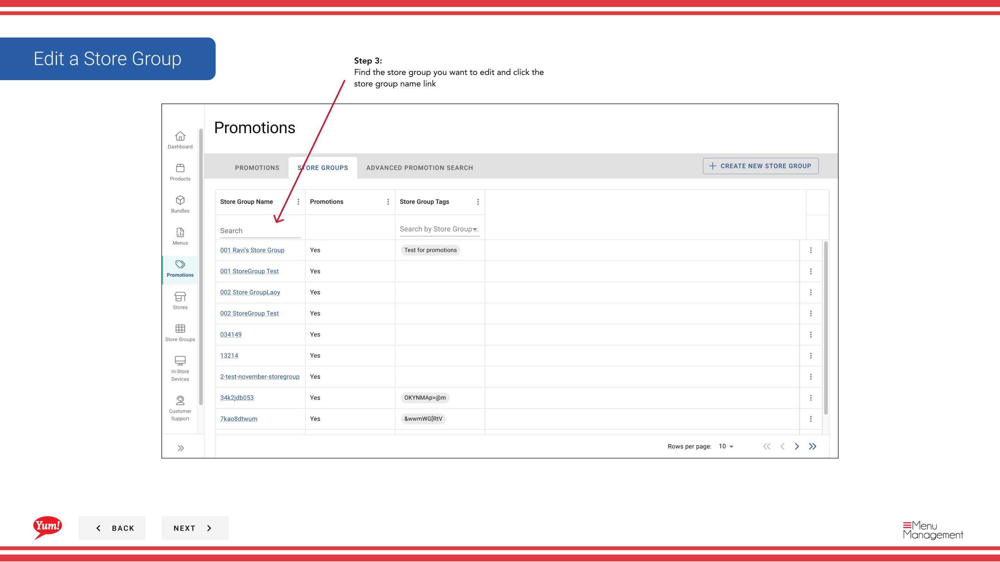
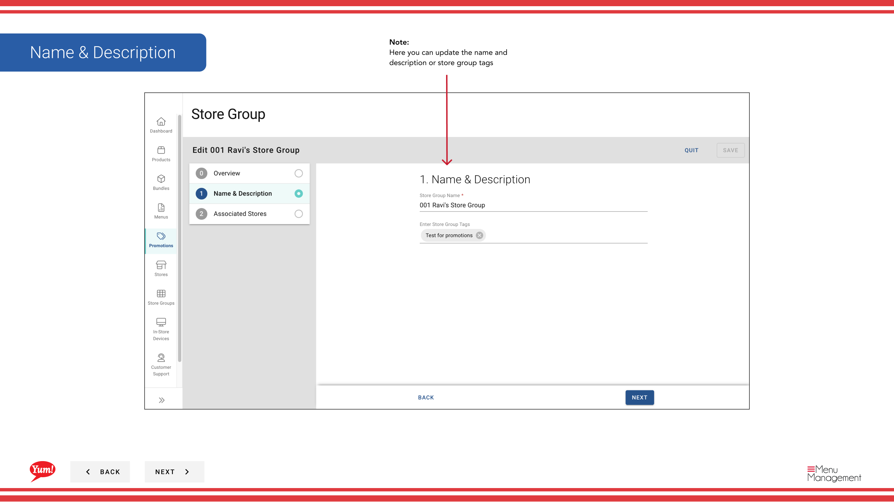

# Modifier un groupe de magasins

## Ce que ce guide couvre

Mettre à jour les détails d'un groupe de magasins ou d'adhésion.

## Étapes

**Step 1:** Commencez par aller à l'écran Promotions en cliquant ici.
**Step 2:** Cliquez sur l'onglet Groupes de Store

**Step 3:** Trouvez le groupe de magasins que vous voulez modifier et cliquez sur le lien nom du groupe de magasins

**Step 4:** Cliquez sur Enregistrer pour enregistrer vos modifications.

## Annexe

:::note :
Il existe plusieurs façons de modifier un groupe de magasins. C'est la façon de le faire par le biais de Promotions. Vous pouvez également le faire via Store Groups dans la navigation principale.
:::

:::note :
Ici vous pouvez voir un aperçu du nom et de la description et des magasins associés
:::

:::note :
Ici vous pouvez mettre à jour le nom et la description ou stocker des étiquettes de groupe
:::

:::note :
Ici vous pouvez ajouter ou supprimer des magasins
:::

## Informations complémentaires

- Promotions - Modifier un groupe de magasins
- C'est l'écran Promotions où vous verrez une liste de toutes les promotions que vous avez créées, créez de nouvelles promotions, recherchez celles que vous avez créées, modifiez et copiez, ajoutez des informations supplémentaires dans le lien Meta et assignez-les aux groupes Store. Les promotions ne peuvent être attribuées qu'à un groupe de magasins et non à un magasin singulier.

---

* Une partie des[Guide du portail administratif](/docs/admin-portal-guide)· Section : Promotions*