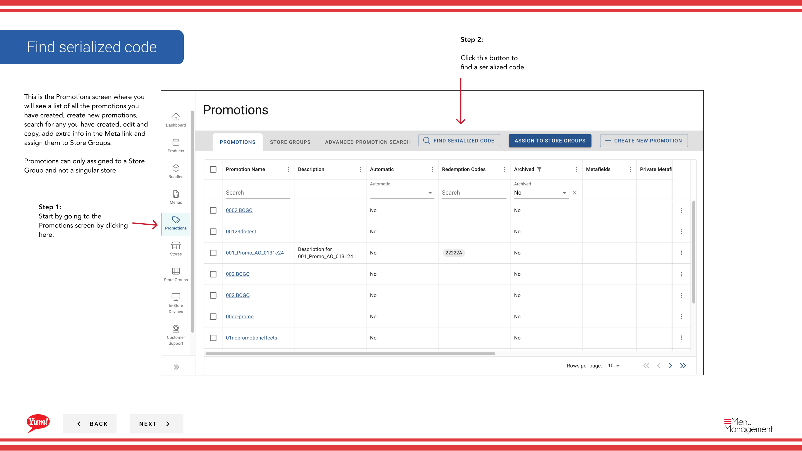

# Trouver un code en série

## Ce que ce guide couvre

Localise un code promotionnel sérialisé spécifique dans Atlas, utilisé pour vérifier l'état de rachat, les problèmes de dépannage ou la gestion de la validité du code.

## Étapes

**Step 1:** Naviguez dans la section **Promotions** en utilisant le menu de navigation de gauche.

**Step 2:** Cliquez sur le bouton **Find Serialized Code** (habituellement visible près de la liste des promotions).

**Step 3:** Entrez le code sérialisé que vous souhaitez consulter dans le champ **recherche** et cliquez sur le bouton **Recherche**.

**Step 4:** Le système affichera les détails du code, y compris:

- **Valeur de code** — Le texte du code actuel
- **Nom de la promotion** — La promotion de ce code est liée à
- ** État** Que le code soit actif, racheté ou annulé
- **Date d'expiration** — Lorsque le code expire

**Step 5 (Optional):** Si vous devez désactiver un code, cliquez sur le bouton **Void Code**. Un code annulé ne peut pas être échangé.

:::note :
Utilisez cette fonctionnalité pour vérifier l'existence d'un code, vérifier son statut de rachat ou résoudre les problèmes des clients avec des codes spécifiques.
:::

## Guides connexes

- [Créer un code sérialisé](/docs/admin-portal-guide/promotions/create-serialized-code/)
- [Créer une promotion](/docs/admin-portal-guide/promotions/create-a-promotion/)

---

* Une partie des[Guide du portail administratif](/docs/admin-portal-guide)· Section : Promotions*