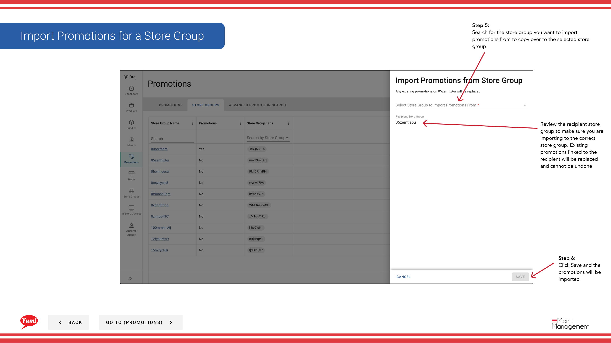

# Promotions d'importation pour un groupe de magasins

## Ce que ce guide couvre

Des missions de promotion d'importations en vrac d'un groupe de magasins à un autre, utilisées lors de la mise en place de grandes campagnes de promotion dans de nombreux magasins ou duplication de promotions d'une configuration existante.

## Étapes

**Step 1:** Naviguez dans la section **Promotions** en utilisant le menu de navigation de gauche.

**Step 2:** Cliquez sur l'onglet **Store Groups**.

**Step 3:** Trouvez le groupe de magasins qui recevra** les promotions (le groupe de destination). C'est le groupe dans lequel vous voulez importer des promotions.

**Step 4:** Cliquez sur le bouton de menu **action** (trois points) à côté du nom du groupe de magasin, puis sélectionnez **Import Promotions**.

**Step 5:** Une boîte de dialogue vous demandera de sélectionner le groupe de magasins pour importer des promotions **de** (le groupe source). Recherchez et sélectionnez le groupe de magasins qui a les promotions que vous voulez copier.

**Step 6:** Consultez le résumé de l'importation et cliquez sur **Enregistrer** pour compléter l'importation.

:::caution
**Important:** Les promotions d'importation seront **remplacer** toute promotion existante liée au groupe de magasins de destination. L'opération ne peut être annulée. Assurez-vous d'importer au bon groupe de magasins avant de confirmer.
:::

:::tip
Si vous voulez importer des promotions spécifiques plutôt que toutes, basculez l'option « Importer tout » et sélectionnez plutôt des promotions individuelles.
:::

## Guides connexes

- [Voir les promotions pour un groupe Store](/docs/admin-portal-guide/promotions/view-promotions-for-a-store-group/)
- [Affecter des promotions aux groupes de magasins](/docs/admin-portal-guide/promotions/assign-promotions-to-store-groups/)
- [Promotions d'importation (section Groupes de marchandises)](/docs/admin-portal-guide/store-groups/import-promotions-for-a-store-group/)

---

* Une partie des[Guide du portail administratif](/docs/admin-portal-guide)· Section : Promotions*