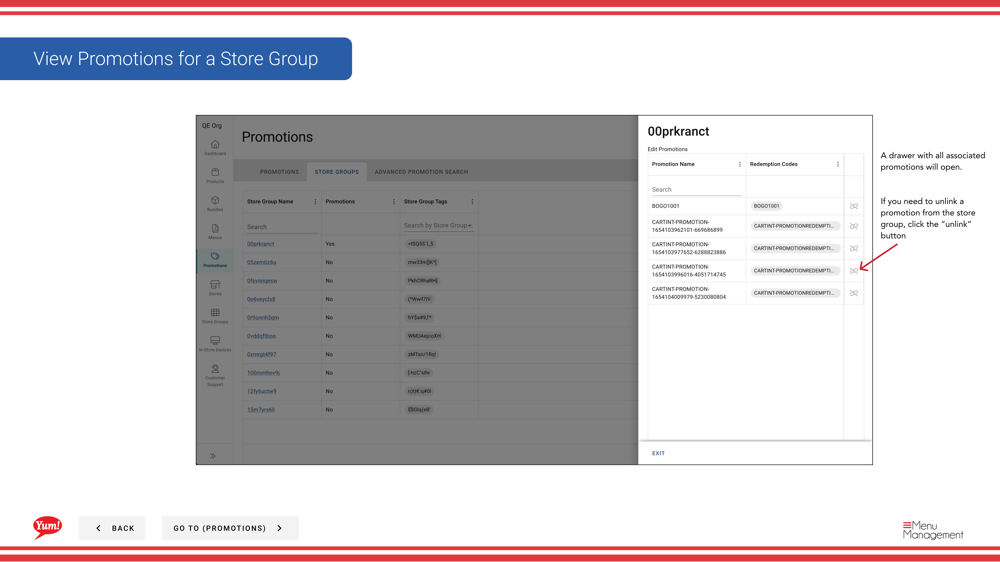

# Voir les promotions pour un groupe Store

## Ce que ce guide couvre

Liste toutes les promotions attribuées à un groupe de magasins à des fins de visibilité et de vérification.

## Étapes

**Step 1:** Naviguez dans la section **Promotions** en utilisant le menu de navigation de gauche.

**Step 2:** Cliquez sur l'onglet **Store Groups**.

**Step 3:** Trouvez le groupe de magasins pour lequel vous voulez voir des promotions en parcourant la table ou en utilisant la barre de recherche.

**Step 4:** Cliquez sur le bouton de menu **action** (trois points) à côté du nom du groupe de magasin, puis sélectionnez **Promotions**.

**Step 5:** Un panneau de tiroirs sera ouvert montrant toutes les promotions attribuées à ce groupe de magasins. La liste comprend:

- **Nom de la promotion** — Le nom du client de la promotion
- **Description** — Brève description de la promotion
- ** État** Que la promotion soit active ou archivée

**Step 6 (Optional):** Pour supprimer une promotion du groupe de magasins, cliquez sur le bouton **Unlink** à côté du nom de la promotion. On vous demandera de confirmer le retrait.

:::note :
Déconnecter une promotion d'un groupe de magasins le rend immédiatement indisponible dans tous les magasins de ce groupe.
:::

## Guides connexes

- [Affecter des promotions aux groupes de magasins](/docs/admin-portal-guide/promotions/assign-promotions-to-store-groups/)
- [Modifier les promotions (des groupes de magasins)](/docs/admin-portal-guide/store-groups/edit-promotions/)
- [Désigner les promotions du groupe Store](/docs/admin-portal-guide/store-groups/unassign-promotions-from-store-group/)

---

* Une partie des[Guide du portail administratif](/docs/admin-portal-guide)· Section : Promotions*