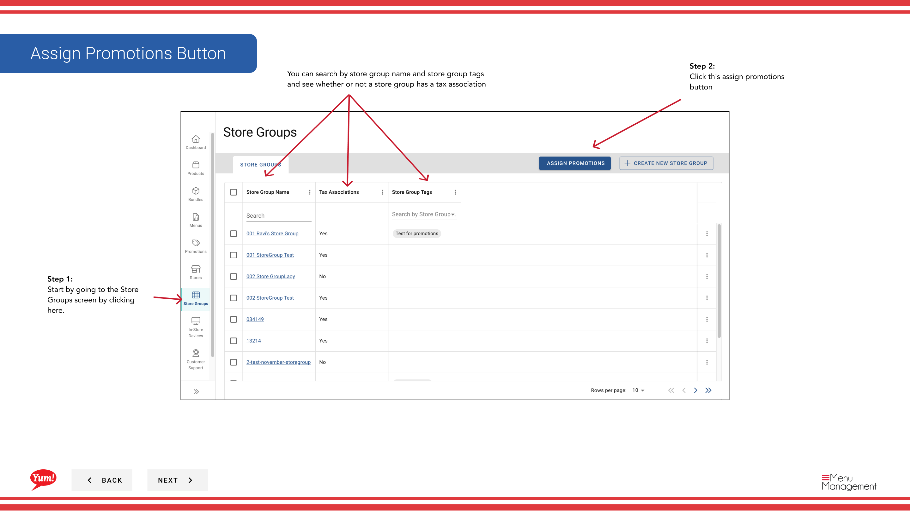

# Affecter des promotions

## Ce que ce guide couvre

Assigne une ou plusieurs promotions à un groupe de magasins, les activant simultanément dans tous les magasins membres.

## Étapes

**Step 1:** Naviguez vers la section **Groupes de magasins** en utilisant le menu de navigation de gauche.

**Step 2:** Cliquez sur le bouton **Assigner les Promotions** (habituellement affiché bien en vue près du haut de la page).

**Step 3:** Sélectionnez les promotions que vous souhaitez attribuer. Vous pouvez :

- **Cochez la case** à côté de chaque nom de promotion pour la sélectionner
- **Utilisez « Tout sélectionner »** pour sélectionner toutes les promotions visibles (ou **« Tout sélectionner »** pour effacer les sélections)
- **Rechercher** pour des promotions spécifiques en utilisant la barre de recherche

**Step 4:** Une fois que vous avez sélectionné vos promotions, cliquez sur le bouton **Next** ou cliquez sur l'indicateur d'étape suivante pour procéder.

**Step 5:** Sélectionnez le ou les groupes de magasins qui devraient recevoir ces promotions. Vous pouvez :

- **Cochez la case** à côté du nom de chaque groupe de magasins
- **Rechercher** pour des groupes de magasins spécifiques par nom ou étiquette

**Step 6:** Passez en revue vos sélections et cliquez sur le bouton **Assigner** pour appliquer les promotions aux groupes de magasins sélectionnés.

:::note :
Une fois assignées, les promotions deviennent actives immédiatement pour tous les magasins des groupes de magasins sélectionnés et sont affichées sur leurs canaux de commande numériques.
:::

:::tip
Vous pouvez également attribuer des promotions à partir de la section Promotions. Voir[Affecter des promotions aux groupes de magasins](/docs/admin-portal-guide/promotions/assign-promotions-to-store-groups/)pour ce flux de travail.
:::

## Guides connexes

- [Créer une promotion](/docs/admin-portal-guide/promotions/create-a-promotion/)
- [Modifier les promotions](/docs/admin-portal-guide/store-groups/edit-promotions/)
- [Désigner les promotions du groupe Store](/docs/admin-portal-guide/store-groups/unassign-promotions-from-store-group/)
- [Promotions d'importation pour un groupe de magasins](/docs/admin-portal-guide/store-groups/import-promotions-for-a-store-group/)

---

* Une partie des[Guide du portail administratif](/docs/admin-portal-guide)· Section : Groupes de magasins*