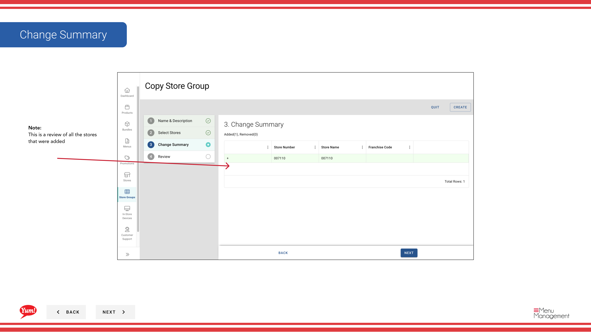

# Copier un groupe de magasins

## Ce que ce guide couvre

Dupliquer la configuration d'un groupe de magasins comme point de départ pour un nouveau groupe, copier des magasins et des étiquettes mais créer un nouveau groupe de magasins indépendant.

## Étapes

**Step 1:** Naviguez vers la section **Groupes de magasins** en utilisant le menu de navigation de gauche.

**Step 2:** Trouvez le groupe de magasins que vous souhaitez copier en parcourant la table ou en utilisant la barre de recherche. Cliquez sur le bouton de menu **action** (trois points) à côté du nom du groupe de magasins.

**Step 3:** Cliquez sur **Copier**.

**Step 4:** Mettre à jour les détails du groupe de magasins:

| Champ | Quoi entrer | Annexe |
|-------|--------------|-------|
| ** Nom du groupe* * | Un nouveau nom unique pour ce groupe | Le système copie le nom original; vous devez le modifier. Par exemple, "Groupe de franchise NSW - Copier". |
| **Store Group Tags** | Étiquettes pour le filtrage et la notification | Les étiquettes du groupe original sont automatiquement incluses. Vous pouvez ajouter ou supprimer au besoin. |

**Step 5:** Examiner et ajuster l'adhésion au magasin si nécessaire :

- **Les stores du groupe d'origine sont automatiquement sélectionnés** (les commutateurs sont allumés)
- **Toggle OFF** pour supprimer tous les magasins que vous ne voulez pas dans le nouveau groupe
- **Toggle ON** pour ajouter des magasins supplémentaires
- Utilisez le filtre **"Afficher inclus"** pour afficher rapidement seulement les magasins sélectionnés
- **Filter par numéro de magasin, nom de magasin ou code de franchise** pour trouver des magasins spécifiques

**Step 6:** Consultez le résumé de toutes les modifications et cliquez sur le bouton **Créer** pour enregistrer le nouveau groupe de magasins.

:::note :
Le groupe de magasins copiés est indépendant de l'original. Les changements apportés à l'un ou l'autre groupe n'affecteront pas l'autre. L'adhésion au magasin est automatiquement copiée depuis le groupe original, mais peut être modifiée avant d'enregistrer.
:::

## Guides connexes

- [Créer un groupe de magasins](/docs/admin-portal-guide/store-groups/create-a-store-group/)
- [Modifier un groupe de magasins](/docs/admin-portal-guide/store-groups/edit-a-store-group/)
- [Supprimer un groupe Store](/docs/admin-portal-guide/store-groups/delete-a-store-group/)

---

* Une partie des[Guide du portail administratif](/docs/admin-portal-guide)· Section : Groupes de magasins*