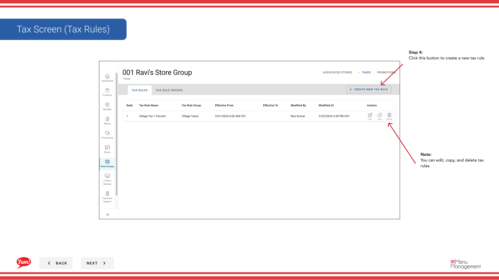

# Créer des règles fiscales

## Ce que ce guide couvre

Définit les règles fiscales individuelles au sein d'un groupe de magasins, précisant les taux d'imposition, les conditions et les filtres de produits appliqués aux articles vendus dans les magasins membres.

## Étapes

**Step 1:** Naviguez vers la section **Groupes de magasins** en utilisant le menu de navigation de gauche.

**Step 2:** Trouvez le groupe de magasins où vous voulez créer une règle fiscale. Cliquez sur le bouton de menu **action** (trois points) à côté du nom du groupe de magasins.

**Step 3:** Cliquez sur **Taxes** dans le menu déroulant.

**Step 4:** Cliquez sur le bouton **+ Créer une nouvelle règle fiscale**.

**Step 5:** Remplir les renseignements sur les règles fiscales de base. Les champs marqués d'un * sont obligatoires.

| Champ | Quoi entrer | Annexe |
|-------|--------------|-------|
| **Données fiscales** * | Nom interne pour cette règle | Par exemple, « TPS standard 10 % », « Taxe sur les frais de livraison ». Visible pour les opérateurs. |
| **En vigueur à partir de la date** * | Date à laquelle cette règle prend effet | Vous pouvez utiliser les dates passées pour les documents historiques. Format: DD/MM/AAAA. |
| **Groupe des règles fiscales** | Affectation à un groupe existant ou nouveau | Facultatif. Grouper plusieurs règles fiscales connexes ensemble pour faciliter la gestion. |

**Step 6:** Ajouter des conditions qui déclenchent cette règle fiscale. Cette section est facultative.

| Champ | Quoi entrer | Annexe |
|-------|--------------|-------|
| **Conditions desarts** | Choisir les conditions en fonction de l'ordre général | Par exemple, « la commande contient la livraison », « le total desarts dépasse 50 $. Choisissez parmi la liste déroulante. |
| ** Filtres de produits** | Sélectionner les produits/catégories qui s'appliquent | Par exemple, "Seuls les éléments de menu dans la catégorie Burgers". Choisissez parmi la liste déroulante. |

**Step 7:** Cliquez sur le bouton **+ Ajouter la taxe** pour définir le calcul de la taxe.

**Step 8:** Remplissez les détails du calcul de la taxe:

| Champ | Quoi entrer | Annexe |
|-------|--------------|-------|
| **Mode de taux** | Choisissez comment calculer la taxe | **Pourcentage** (p. ex., TPS de 10 %) ou **Montant fixe** (p. ex., 0,50 $ par article) |
| **Appliquée à** | Ce que la taxe s'applique à | Par exemple, sous-total, frais de livraison ou catégories d'articles spécifiques |
| **Taxe %** | Inscrivez le taux d'imposition en pourcentage | Pour le mode pourcentage seulement. Inscrivez uniquement les numéros (p. ex.`10`pour 10 % de TPS) |

**Step 9:** (Facultatif) Remplir **Taxes sur les frais d'utilisation** si vous devez appliquer des taxes sur les frais provenant de plates-formes de livraison tierces.

**Step 10:** Cliquez pour créer la règle fiscale. Un écran de révision affichera toutes les informations que vous avez saisies. Cliquez sur **Créer** pour enregistrer.

:::note :
Vous pouvez cliquer sur n'importe quel numéro d'étape dans l'assistant pour naviguer vers cette section sans perdre vos modifications. Vous pouvez également modifier, copier et supprimer les règles fiscales après la création.
:::

:::tip
Créer un groupe de règles fiscales d'abord si vous voulez organiser ensemble les règles fiscales connexes. Voir[Créer un groupe de règles fiscales](/docs/admin-portal-guide/store-groups/create-tax-rule-group/)pour les instructions.
:::

## Guides connexes

- [Créer un groupe de règles fiscales](/docs/admin-portal-guide/store-groups/create-tax-rule-group/)
- [Modifier un groupe de magasins](/docs/admin-portal-guide/store-groups/edit-a-store-group/)

---

* Une partie des[Guide du portail administratif](/docs/admin-portal-guide)· Section : Groupes de magasins*