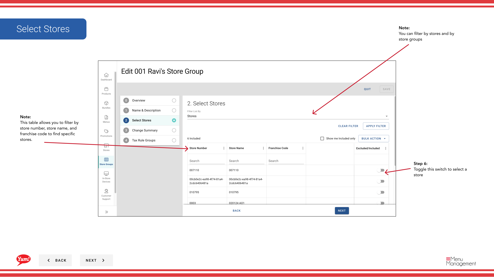

# Modifier un groupe de magasins

## Ce que ce guide couvre

Actualise les détails d'un groupe de magasins, le nom, l'adhésion au magasin ou les règles fiscales connexes.

## Étapes

**Step 1:** Naviguez vers la section **Groupes de magasins** en utilisant le menu de navigation de gauche.

**Step 2:** Trouvez le groupe de magasins que vous souhaitez modifier en parcourant la table ou en utilisant la barre de recherche. Cliquez sur le bouton de menu **action** (trois points) à côté du nom du groupe de magasins.

**Step 3:** Cliquez sur **Edit**.

**Step 4:** Vous verrez l'éditeur Store Group montrant tous les détails actuels et l'adhésion au magasin.

**Step 5:** Mettre à jour les détails du groupe de magasins au besoin:

| Champ | Quoi mettre à jour | Annexe |
|-------|----------------|-------|
| **Nom du groupe* | Nom descriptif du groupe | Par exemple, "Groupe de franchise NSW". |
| **Store Group Tags** | Étiquettes pour le filtrage et la notification | Par exemple, "pilote", "entreprise". |

**Step 6:** Mettre à jour l'adhésion au magasin en tuggling des commutateurs à côté des noms de magasin :

- **Toggle ON** pour ajouter un magasin au groupe
- **Toggle OFF** pour enlever un magasin du groupe
- **Filter par numéro de magasin, nom du magasin ou code de franchise** pour trouver rapidement des magasins spécifiques

**Step 7:** Examiner le résumé de toutes les modifications apportées au cours de cette session. Cliquez sur **Enregistrer** pour appliquer les mises à jour.

:::note :
Vous pouvez cliquer sur n'importe quel numéro d'étape dans l'assistant pour sauter à cette section sans perdre vos modifications.
:::

:::tip
Si ce groupe de magasins a des règles fiscales, vous pouvez les afficher et les modifier en cliquant sur le bouton de menu **action** et en sélectionnant **Taxes**.
:::

## Guides connexes

- [Créer un groupe de magasins](/docs/admin-portal-guide/store-groups/create-a-store-group/)
- [Copier un groupe de magasins](/docs/admin-portal-guide/store-groups/copy-a-store-group/)
- [Supprimer un groupe Store](/docs/admin-portal-guide/store-groups/delete-a-store-group/)
- [Afficher les magasins dans un groupe de magasins](/docs/admin-portal-guide/store-groups/view-stores-in-a-store-group/)
- [Créer des règles fiscales](/docs/admin-portal-guide/store-groups/create-tax-rules/)

---

* Une partie des[Guide du portail administratif](/docs/admin-portal-guide)· Section : Groupes de magasins*