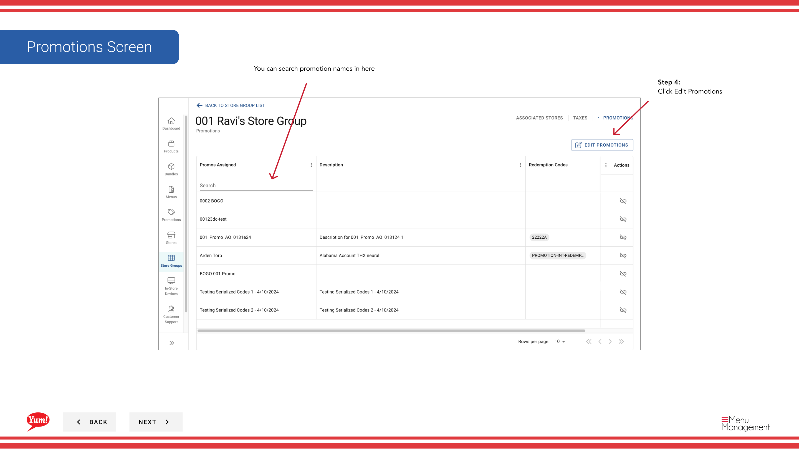

# Modifier les promotions

## Ce que ce guide couvre

Ajoute ou supprime les affectations promotionnelles pour un groupe de magasins spécifique, vous permettant de modifier les promotions actives dans les magasins membres.

## Étapes

**Step 1:** Naviguez vers la section **Groupes de magasins** en utilisant le menu de navigation de gauche.

**Step 2:** Trouvez le groupe de magasins dont vous souhaitez modifier les promotions. Cliquez sur le bouton de menu **action** (trois points) à côté du nom du groupe de magasins.

**Step 3:** Cliquez sur **Promotions** dans le menu déroulant.

**Step 4:** Un tiroir de promotion ouvrira. Cliquez sur le bouton **Modifier les promotions** pour entrer dans le mode d'édition.

**Step 5:** Modifier les affectations de promotion :

- **Pour ajouter une promotion:** Cochez la case à côté des noms de promotion que vous voulez ajouter
- **Pour supprimer une promotion:** Décochez la case à cocher à côté des noms de promotion que vous souhaitez supprimer
- **Rechercher** pour des promotions spécifiques en utilisant la barre de recherche
- Basculer le **"Afficher d'autres promotions"** passer à afficher les promotions non assignées actuellement (si coché, vous pouvez voir toutes les promotions disponibles; si non cochées, vous ne voyez que celles assignées actuellement)

**Step 6:** Examinez vos changements dans la section sommaire montrant les promotions ajoutées et supprimées. Cliquez sur le bouton **Assigner** pour appliquer les modifications. (Le bouton Assigner n'est activé qu'après avoir apporté des modifications.)

:::note :
Les changements aux affectations promotionnelles prennent effet immédiatement pour tous les magasins de ce groupe de magasins.
:::

:::tip
Vous pouvez rechercher des noms de promotion dans la barre de recherche pour trouver rapidement des promotions que vous voulez ajouter ou supprimer.
:::

## Guides connexes

- [Affecter des promotions](/docs/admin-portal-guide/store-groups/assign-promotions/)
- [Désigner les promotions du groupe Store](/docs/admin-portal-guide/store-groups/unassign-promotions-from-store-group/)
- [Promotions d'importation pour un groupe de magasins](/docs/admin-portal-guide/store-groups/import-promotions-for-a-store-group/)
- [Voir les promotions pour un groupe Store (section Promotions)](/docs/admin-portal-guide/promotions/view-promotions-for-a-store-group/)

---

* Une partie des[Guide du portail administratif](/docs/admin-portal-guide)· Section : Groupes de magasins*